
    
[`main`](https://github.com/LoriaLawrenceZ/FIAP-2ESOA-F1/tree/main) | [`cap-1`](https://github.com/LoriaLawrenceZ/FIAP-2ESOA-F1/tree/cap-1) | [`cap-2`](https://github.com/LoriaLawrenceZ/FIAP-2ESOA-F1/tree/cap-2) | [`cap-3`](https://github.com/LoriaLawrenceZ/FIAP-2ESOA-F1/tree/cap-3) | [`cap-4`](https://github.com/LoriaLawrenceZ/FIAP-2ESOA-F1/tree/cap-4) | [`cap-5`](https://github.com/LoriaLawrenceZ/FIAP-2ESOA-F1/tree/cap-5) | [`cap-6`](https://github.com/LoriaLawrenceZ/FIAP-2ESOA-F1/tree/cap-6) | [`cap-7`](https://github.com/LoriaLawrenceZ/FIAP-2ESOA-F1/tree/cap-7) | [`cap-8`](https://github.com/LoriaLawrenceZ/FIAP-2ESOA-F1/tree/cap-8) | [`cap-9`](https://github.com/LoriaLawrenceZ/FIAP-2ESOA-F1/tree/cap-9) | [`cap-10`](https://github.com/LoriaLawrenceZ/FIAP-2ESOA-F1/tree/cap-10)

    <h1 align=center>CAPÍTULO 5</h1>

>**Capítulo 5 - Arquiteturas e modelo de referência em redes**

---

    
📌 Índice

- [DAS ORIGENS DAS REDES À INDEPENDÊNCIA DOS NÍVEIS DE EVOLUÇÃO](#das-origens-das-redes-à-independência-dos-níveis-de-evolução)
- [MODELO OSI DA ISO](#modelo-osi-da-iso)
- [A PILHA DE PROTOCOLOS NA ARQUITETURA TCP/IP](#a-pilha-de-protocolos-na-arquitetura-tcpip)
    - [Comparação entre o modelo OSI e TCP/IP](#comparação-entre-o-modelo-osi-e-tcpip)
- [A COMUNICAÇÃO EM REDES SEGUINDO UMA ARQUITETURA](#a-comunicação-em-redes-seguindo-uma-arquitetura)
- [EXEMPLO DE COMUNICAÇÃO SEGUINDO A ARQUITETURA TCP/IP](#exemplo-de-comunicação-seguindo-a-arquitetura-tcpip)
    - [Passo 1: A Camada de Aplicação](#passo-1-a-camada-de-aplicação)
    - [Passo 2: A Camada de Transporte](#passo-2-a-camada-de-transporte)
    - [Passo 3: A Camada de Rede](#passo-3-a-camada-de-rede)
    - [PAsso 4: A Camada de Acesso à Rede](#passo-4-a-camada-de-acesso-à-rede)
    - [Análise Realizada pelos Protocolos no Destino](#análise-realizada-pelos-protocolos-no-destino)
- [CONSIDERAÇÕES FINAIS](#considerações-finais)

---

# DAS ORIGENS DAS REDES À INDEPENDÊNCIA DOS NÍVEIS DE EVOLUÇÃO

Durante as décadas de 1960 e 1970 foram ciradas muitas tecnologias de redes, sendo que cada uma apresentava uma 
estrutura específica de hardware. Essas estruturas eram de arquitetura monolítica, o que significava que os 
desenvolvedores trabalhavam com todos os elementos (todos os níveis) envolvidos no processo, sem separação. Um mesmo
desenvolvedor tinha que se procupar com o sistema, o hardware envolvido na comunicação e no meio de transmissão.

Essa forma de desenho era pouoco prática, uma vez que, com esse grande bloco de informações, todos os elementos tinham
que ser modificados caso ocorrsse uma pequena mudança em alguma parte da estrutura.

Surgiu então a necessidade de definição de uma arquitetura que fosse padrão para as redes, o que permitiria que 
equipamentos de fabricantes distintos pudessem se interconectar, além de permitir independência entre os níveis. 

(<a href="#readme-top">back to top</a>)

# MODELO OSI

O modelo OSI (Open Systems Interconnection) apresenta uma organização em camadas, ou módulos, para as funcionalidades
envolvidas em uma comincação em redes. Assim não temos mais uma estrutura monolítica, na qual um fabricante terá que 
cuidar de toda a tecnologia envolvida na comunicação em rede. Um fabricante poderá desenvolver sua tecnologia em uma ou
mais camadas. Outros fabricantes poderão desenvolver suas tecnologias na mesma ou em outras camadas, também seguindo os
padrões definidos. Ao final, visto que todos sigam os padrões definidos pelo modelo, a interoperabildade entre os
diferentes fabricantes se dará naturalmente, uma vez que o padrão definido em cada camada prevê a interface com os
padrões definidos para as outras camadas.

(<a href="#readme-top">back to top</a>)

# MODELO OSI DA ISO

A **ISO (International Organization for Standardization)** foi uma das primeiras organizações a definir formalmente uma 
arquitetura-padrão, ou modelo, com o objetivo de facilitar o processo de interconectividade entre máquiinas de 
diferentes fabricantes. Assim, em 1984, tornou disponível o modelo chamado **OSI (Open Systems Interconnection)**, ou
**modelo OSI**.

Trata-se de um modelo que estabelece padrões e orientações para que ocorra a interconectividade de dois dispositivos de
rede, independentemente das empresas envolvidas na fabricação das tecnologias envolvidas.

Esse conceito de modelo baseado em sete camadas foi fornecido por **Charles Bachman**. A evolução do projeto OSI começou 
a partir da experiência com a ARPANET.

Assim, seguindo a lógica da organização de padrões em camadas, o desenvolvedor de um sistema deverá seguir padrões 
definidos para a camada respectiva ao seu sistema sem ter que conhecer as tecnologias de outras camadas. 

Isso é muito vantajoso e facilita a evolução tecnológica, já que o desenvolvimento em uma camada não afetará 
necessariamente todas as demais camadas.

Modelo OSI serve de base para que ocorra a comunicação em qualquer tipo de rede (curta, média ou longa distância), 
independente dos fabricantes envolvidos. O surgimento do modelo permitiu então a padronização e interoperabilidade 
(operação entre sistemas de fabricantes distintos).

O modelo OSI organiza suas orientações em pilhas de protocolos, ou **camadas**. Cada camada organiza um conjunto de 
regras que define como serão realizados a operação e o intercâmbio das informações entre dois sistemas. Todas as funções
necessárias para que ocorra a interconectivbidade de dispositivos de rede foram organizadas em sete camadas no modelo 
OSI, numerados de 1 a 7.

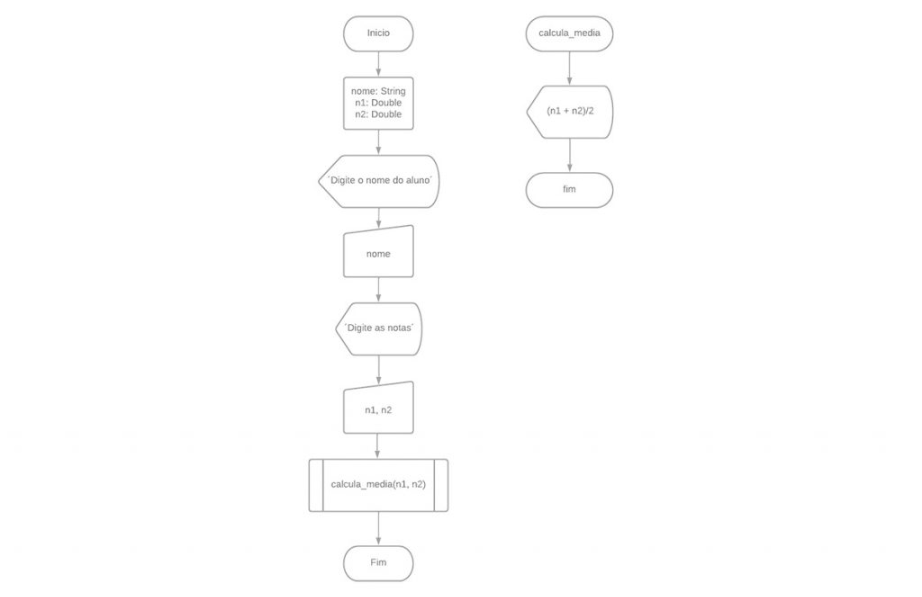

O modelo é composto por sete camadas e cada uma delas realiza funções específicas no processo de comunicação em redes.
As camadas do modelo OSI são:

- **Camada 7 - Aplicação** (application)
- **Camada 6 - Apresentação** (presentation)
- **Camada 5 - Sessão** (session)
- **Camada 4 - Transporte** (transport)
- **Camada 3 - Rede** (network)
- **Camada 2 - Enlace** (data link)
- **Camada 1 - Física** (physical)

Os padrões estão organizados no modelo OSI de forma que entre cada camada exista um padrão para interface. Esse padrão 
para interface permite que as tecnologias situadas em camadas diferentes troquem informações entre si. O padão também
define quais primitivas, operações e serviços uma camada inferior oferece à camada imediatamente superior. Cada camada é
independente e executa somente suas funções, independente das funções de outras camadas.

Apesar da divisão em sete níveis no modelo OSI, pode-se considerar genericamente que as três camadas mais baixas do 
modelo cuidam dos aspectos relacionados à transmissão propriamente dita, a quarta camada lida com comunicação fim a fim,
enquanto as três camadas superiores apresentam os aspectos relacionados à aplicação, que fornece a interface com o 
usuário do sistema.

(<a href="#readme-top">back to top</a>)

# A PILHA DE PROTOCOLOS NA ARQUITETURA TCP/IP

Apesar do modelo OSI ser a referência para o estudo e a nomenclatura dos níveis de atuação das tecnologias envolvidas 
nas redes de comunicação, a arquitetura TCP/IP surgiu com os priomórdios da Internet e está em uso até os dias de hoje
tanto nas redes internas (intranets) como na Internet, tornando a arquitetura mais referenciada pela indústria 
atualmente.

A arquitetura TCP/IP é composto por quatro camadas (formando a pilha da estrutura do protocolo).

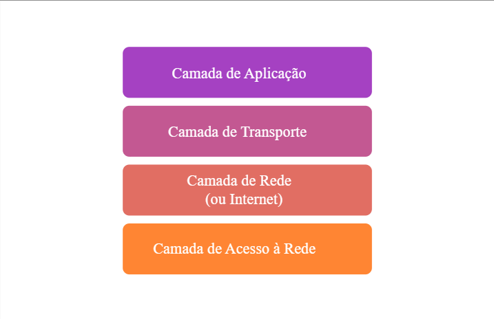

O TCP/IP teve origem em um estudo feito pelos pesquisadores estadunidenses **Vinton Cerf** e **Robert Kahn** (1974), que
propuseram um grupo de protocolos centrais parar satisfazer as seguintes necessidades na então ARPANET:

- Permitir o roteamento entre redes diferentes (chamadas *subnets* ou sub-redes).
- Garantir a independência da tecnologia de redes utilizada para poder conectar as sub-redes.
- Tornar o uso de hardware na rede independente do seu fabricante.
- Possibilitar a recuperação de falhas ocorridas durante uma transmissão.

Originalmente os protocolos propostos foram chamados de NCP (Network Control Protocol), mas em 1978 passaram a ser
chamados de **TCP/IP**.

Em 1980, o DARPA começou a implementar o TCP/IP na ARPANET, dando origem à Internet. Em 1983, o DARPA finalizou a 
conversão de todos os seus computadores e exigiu a implementação do TCP/IP em todos os computadores que desejassem se
conectar à ARPANET.

A arquitetura TCP/IP (assim como o modelo de referência OSI da ISO) realiza a divisão de funções do sistema de 
comunicação de redes em uma estrutura de camadas. Na arquitetura TCP/IP as camadas são: aplicação, transporte, rede 
(também referenciada como Internet) e acesso à rede. Assim como no modelo OSI/ISO, as camadas TCP/IP são representadas
por uma pilha.

A família de protocolos TCP/IP foi pioneira na utilização do conceito de níveis, formando uma arquitetura estruturada, 
racional e simples, fácil de modificar. Posteriormente, a ISO adotou esses conceitos para criar o modelo OSI.

Atualmente, o conjunto de protocolos TCP/IP inclui muitos protocolos. Os protocolos individuais são organizados em 
camadas que usam o modelo de protocolo TCP/IP: aplicação, transporte, rede (ou Internet) e acesso à rede. Os protocolos 
que compõem o TCP/IP são específicos para as camadas de aplicação, transporte e Internet. Os protocolos de camada de 
acesso à rede são responsáveis pela entrega do pacote IP pelo meio físico. Esses protocolos da camada inferior foram
desenvolvidos por várias empresas de padrões.

A arquitetura TCP/IP é implementada como uma pilha de protocolos TCP/IP nos dispositicos de origem e destino envolvidos 
na comunicação prover entrega fim a fim de aplicações pela rede. Os protocolos Ethernet são usados para transmitir o
pacote IP pelo meio físico usado pela rede local (LAN)

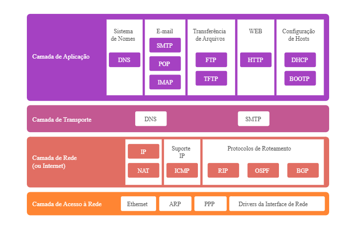

## Comparação entre o modelo OSI e TCP/IP

Enquanto o modelo OSI organiza seus padrões em sete camadas, a arquitetura TCP/IP é composta por quatro camadas 
(formando a pilha de protocolos da estrutura TCP/IP) e, na prática, as camadas 5, 6 e 7 do modelo OSI foram mescladas 
para formar a camada de aplicação do TCP/IP. Já as camadas 3 e 4 do modelo OSI são similares às camadas 2 e 3 do TCP/IP,
inclusive a camada de transporte do TCP/IP tem o mesmo nome, porém a camada 3 do modelo OSI (rede) no TCP/IP, muitas 
vezes, é referenciada como camada Internet. Por fim, as camadas 1 e 2 do modelo OSI foram mescladas no TCP/IP para 
formar a camada de acesso aos meios ou acesso à rede.

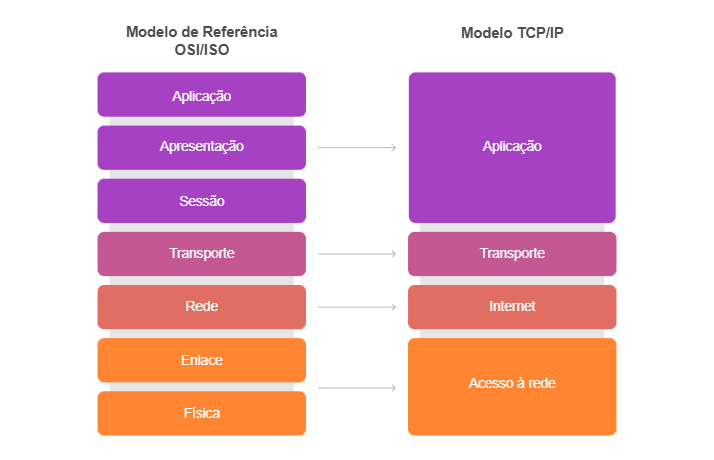

Na camada de acesso à rede, a pilha de protocolos TCP/IP não especifica que protocolos usar ao transmitir por um meio
físico, ele descreve somente a transmissãod a camada de Internet aos protocolos da rede física. As camadas 1 e 2 do
modelo OSI discutem os procedimentos necessários para acessar a mídia e o meio físico para enviar dados por uma rede.

A camada 3 é usada para descrever os protocolos que endereçam e encaminham mensagens em uma rede.

A camada 4 descreve os serviços e as funções gerais que fornecem uma entrega ordenada e confiável de dados entre os 
*hosts* origem e destino.

A camada de aplicações TCP/IP inclui uma série de protocolos que fornecem uma funcionalidade específica a uma variedade
de aplicações de usuário final. As camadas 5, 6 e 7 do modelo OSI são usadas como referências para desenvolvedores e 
fornecedores de software de aplicação para produzir produtos que operem nas redes.

Ambos os modelos TCP/IP e OSI são usados geralmente para referenciar protocolos em várias camadas. Como o modelo OSI
separa a camada de enlace de dados da camada física, geralmente é usado para referenciar as camadas inferiores.

(<a href="#readme-top">back to top</a>)

# A COMUNICAÇÃO EM REDES SEGUINDO UMA ARQUITETURA

As camadas são processos, implementados por hardware ou software em um dispositivo, que se comunicam com o processo 
correspondente em outro dispositivo na rede. Cada camada oferece um conjunto de serviços ao nível (camada) superior,
usando funções realizadas no próprio nível e serviços disponíveis nos níveis (camadas) inferiores.

Em uma estrutura baseada em camadas, os dados transferidos em uma comunicação de um nível específico em um dispositivo transmissor (por exemplo, o nível da aplicação) não são enviados diretamente ao processo do mesmo nível em outro dispositivo receptor. Os dados são encaminhados primeiramente através de cada camada adjacente no dispositivo transmissor até o nível físico, onde é transmitido, para alcanar o outro dispositivo. Após alcançar o dispositivo receptor, os dados serão encaminhados através de cada nível adjacente nesse dispositivo até a sua camada de aplicação.

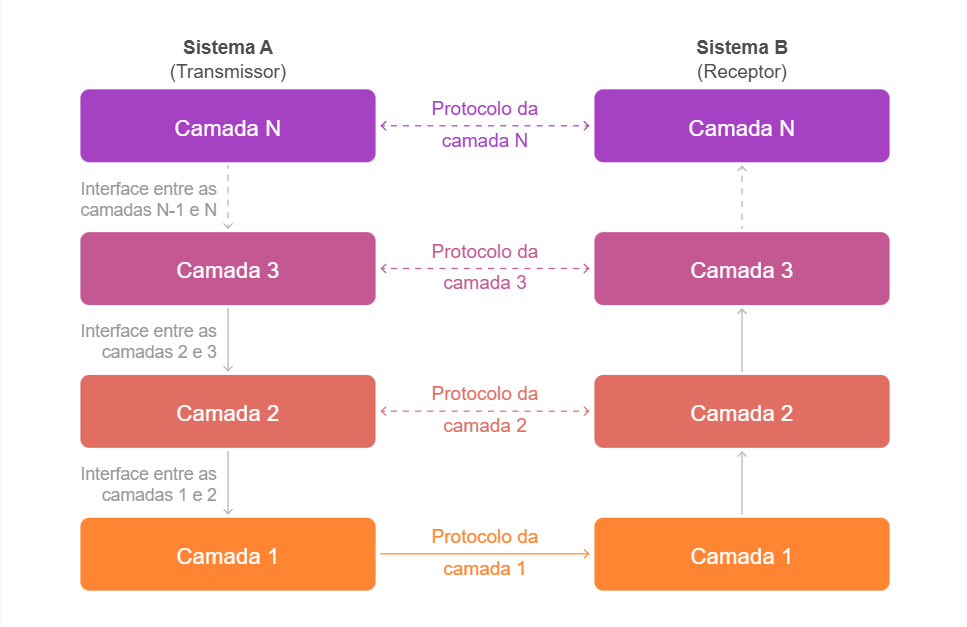

    
<code>IMAGEM | Camadas, interfaces e protocolos</code>

| Sistema A   (Transmissor) | | Sistema B   (Receptor) |
|:---------:|:---:|:---------:|
| Camada N | Protocolo da camada N | Camada N |
| Interface entre as camadas N-1 e N   &#8595; | | &#8593; |
| Camada 3 | Protocolo da camada 3 | Camada 3 |
| Interface entre as camadas 2 e 3   &#8595; | | &#8593; |
| Camada 2 | Protocolo da camada 2 | Camada 2 |
| Interface entre as camadas 1 e 2   &#8595; | | &#8593; |
| Camada 1 | Protocolo da camada 1 | Camada 1 |

Os protocolos são conjuntos de regras e formatos que permitem a comunicação entre as camadas nos diferentes dispositivos. Em cada camada, podem ser definidos um ou mais protocolos. Já as interfaces representam o limite entre cada nível adjacente em que uma camada compreende as informações vindas de outra camada.

Com exceção da camada mais alta, cada camada é usuária dos serviços prestados pela camada imediatamente inferior (n-1) e presta serviços para a camada imediatamente superior (n+1). Essa troca de informações entre as camadas adjacentes ocorre por meio da troca de primitivas de serviços (funções que um nível oferece ao nível imediatamente superior de forma a prover a comunicação entre eles) nas interfaces entre as camadas.

(<a href="#readme-top">back to top</a>)

# EXEMPLO DE COMUNICAÇÃO SEGUINDO A ARQUITETURA TCP/IP

Para compreender como se dá a comunicação em uma rede seguindo um modelo em camadas, vamos considerar o cenário a seguir:

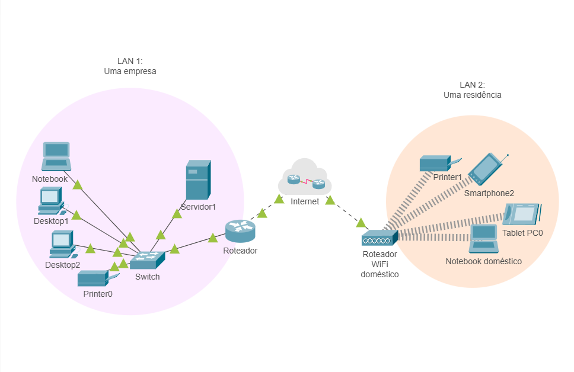

    
<code>IMAGEM | Camadas, interfaces e protocolos</code>

| LAN 1   (empresa) | | LAN 2   (residência) |
|:---------:|:---:|:---------:|
| &#8595; &#8592; | Internet | &#8594; &#8595; |
| Roteador | | Roteador WiFi doméstico |
| Switch | | Printer1 |
| Servidor1 | | Smartphone2 |
| Printer0 | | Tablet PC0 |
| Notebook | | Notebook doméstico |
| Desktop1 | | |
| Desktop2 | | |

No cenário apresentado, há duas redes locais (LAN), sendo a LAN 1 representando a rede local de uma pequena empresa e a LAN 2 representando uma rede local em uma residência. As duas redes estão ligadas à Internet que, na figura, está representada pelo desenho de uma nuvem.

Em nosso primeiro exemplo, um usuário do notebook localizado na rele LAN 1 utilizará um navegador web (*web browser*) para requisitar uma página WWW hospedada no servidor que se encontra na mesma rede local, a LAN 1.

Para isso, temos uma aplicação (*software*) instalada no servidor localizado na rede LAN 1 e que funcionará como servidor de páginas WWW. Essa aplicação foi desenvolvida seguindo os padrões definidos pelo protocolo para comunicações WWW, o protocolo **HTTP (*Hypertext Transfer Protocol*)**. DO outro lado, no noteboook também localizado na rede LAN 1, temos outra aplicação (software) que será utilizada como navegador *web* e que também doi desenvolvida seguindo os padrões definidos pelo protocolo **HTTP**.

Assim como acontece em todas as comunicações em redes que seguem a arquitetura TCP/IP, veremos nesse exemplo que cada camada da arquitetura no equipamento cliente (notebook) trocará informações com a respectiva camada no equipamento servicor.

    
<code>IMAGEM | Troca de Informações entre camadas correspondentes</code>

| Arquitetura TCP/IP   Servidor | | | Arquitetura TCP/IP   Notebook |
|:---------:|:---:|:---:|:---------:|
| Aplicação | Protocolo http   &#8594; | Protocolo http   &#8592; | Aplicação |
| Transporte | Protocolo TCP   &#8594; | Protocolo TCP   &#8592; | Transporte |
| Rede | Protocolo IP   &#8594; | Protocolo IP   &#8592; | Rede |
| Acesso à Rede | Protocolo Ethernet   &#8594; | Protocolo Ethernet   &#8592; | Acesso |

As informações que serão trocadas entre as camadas estão destacadas em:

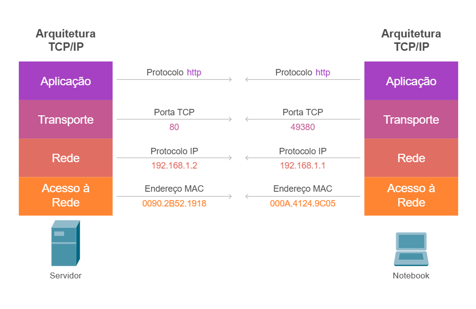

    
<code>IMAGEM | Informações trocadas entre as camadas da arquitetura TCP/IP</code>

| Arquitetura TCP/IP   Servidor | | | Arquitetura TCP/IP   Notebook |
|:---------:|:---:|:---:|:---------:|
| Aplicação | Protocolo http   &#8594; | Protocolo http   &#8592; | Aplicação |
| Transporte | Protocolo TCP   &#8594;   80 | Protocolo TCP   &#8592;   49380 | Transporte |
| Rede | Protocolo IP   &#8594;   192.168.1.2 | Protocolo IP   &#8592;   192.168.1.1 | Rede |
| Acesso à Rede | Protocolo Ethernet   &#8594;   0090.2B52.1918 | Protocolo Ethernet   &#8592;   000A.4124.9C05 | Acesso |

A primeiro momento, devemos considerar apenas que essas informações são complementares e fornecem um esquema de endereçamento para identificar a origem e destino no processo de comunicação entre dois equipamentos.

## Passo 1: A Camada de Aplicação

A camada de aplicação é a camada que fornce aos programas de rede os padrões para que possam se comunicar por meio de uma rede com outros programas.

Alguns programas específicos são levados em conta nessa camada. Eles proveem serviços que fornecem suporte direto às aplicações do usuário. Esses programas e seus correspondentes protocolos incluem:

- ***HTTP*** (Hypertext Transfer Protocol): para navegação na World Wide Web.
- ***FTP*** (File Transfer Protocol): para transporte de arquivos.
- ***SMTP*** (Simple Mail Transfer Protocol): para envio de e-mails.
- ***SSH*** (Secure Shell): para login remoto seguro.
- ***DNS*** (Domain Name System): para tradução de endereços
- E muitos outros

Uma vez que o dado de uma aplicação foi codificado dentro de um padrão de um protocolo da camada de aplicação, ele será passado para a próxima camada da pilha IP: a camada de transporte.

No nosso exemplo , a comunicação entre o cliente (notebook na LAN 1) e o servidor (também na LAN 1) terá iício a partir da execução do *software* responsável pela requisição da página WWW, um navegador *web* (ou *web browser*). Ao executar um navegador *web*, o *software* escolhido estará preparado para fazer uso do protocolo de camada de aplicação para acesso ao serviço escolhido: o protocolo ***HTTP***.

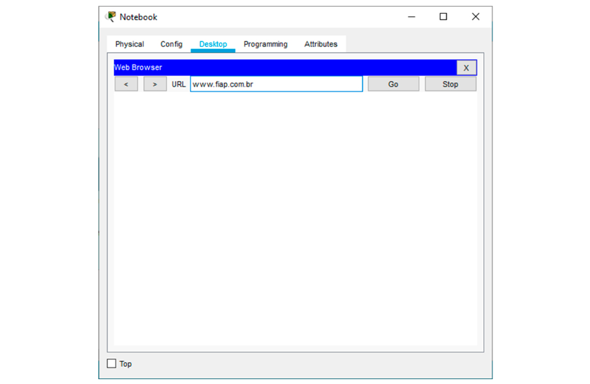

    
<code>IMAGEM | Requisição de uma página *web* a partir de um navegador *web*</code>

Web Browser (Notebook) aberto com URL informada www.fiap.com.br.

No exemplo, a página requisitada está no endereço virtual (***URL*** - *Uniform Resource Locator*) www.fiap.com.br .

Apesar de não ter sido informado o protocolo HTTP inicialmente, o navegador *web* identifica que esse será o protocolo a ser utilizado e complementa a URL fornecida com essa informaão após o usuário pressionar "enter". Cabe enfatizar que isso ocorre pelo fato de que o navegador *web* ter sido desenvolvido seguindo as definições do protocolo HTTP.

>**Observação**: o primeiro passo no processo de comunicação será uma consulta a um serviço ***DNS*** (*Domain Name System*) para a tradução do endereço URL www.fiap.com.br no endereço ***IP*** (*Internet Protocol*) utilizado pelo servidor que hospeda a página *web* requisitada. Para simplificar, será considerado que o endereço foi traduzido para o IP 192.168.1.2, que é o endereço do servidor, assim podendo concentrar no funcionamento do protocolo HTTP.

No primeiro, o *software* cliente (navegador *web*) seguirá os procedimentos definidos na camada de aplicação da arquitetura TCP/IP para, entre outras ações, organizar uma requisição HTTP (**HTTP *request***) a ser encaminhada pela rede até alcançar a camada de aplicação do servidor correspondente.

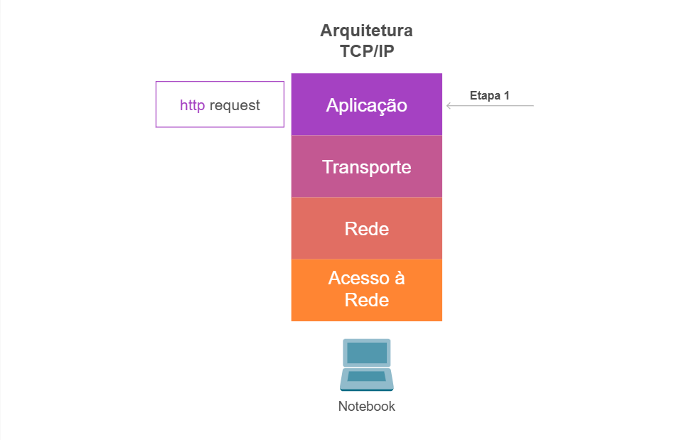

    
<code>IMAGEM | **Etapa 1**: a camada de aplicação</code>

| | Arquitetura TCP/IP | |
| :---: | :---: | :---: |
| **http** request | **Aplicação** | Etapa 1|
| | **Transporte** | |
| | **Rede** | |
| | **Acesso à Rede** | |
| | Notebook | |

Entretanto, a requisição não é encaminhada diretamente para a camada de aplicação do servidor. Antes que essa requisição alcance o meio de transmissão da rede de comunicação, deverá ser encaminhada à camada seguinte, a camada de transporte.

(<a href="#readme-top">back to top</a>)

## Passo 2: A Camada de Transporte

Os protocolos na camada de transporte podem resolver problemas como *confiabilidade* (o dado alcançou seu destino?) e *integridade* (os dados chegaram na ordem correta?). Na pilha de protocolos TCP/IP, os protocolos de transporte também determinam para qual aplicação um dado qualquer é destinado, por meio de uma associação de um endereço de porta (TCP ou UDP) à aplicação.

Na camada de transporte, aplicações irão, em sua maioria, fazer uso de um protocolo denominado ***TCP*** (*Transfer Control Protocol*) ou de um protocolo denominado ***UDP*** (*User Datagrama Protocol*), e aplicações são frequentemente associadas com um número de *porta* de conexão (um endereço que identificará a aplicação) em um desses endereços. Portas para aplicações servidores são oficialmente definidas por um órgão internacional denominado ***IANA*** (*Internet Assigned Numbers Authority*), mas desenvolvedores de novos protocolos frequentemente escolhem os númeos de portas por convicção própria.

Uma vez que é raro ter mais que alguns poucos programas servidores no mesmo servidor, problemas com conflito de portas são raros. Aplicações também geralmente permitem que o usuário especifique números de portas arbitrários por intermédio de parâmetros em tempo de execução.

Em nosso exemplo, a requisição HTTP estruturada na camada de aplicação é encaminhada para a camada de transporte. Uma vez que o protocolo HTTP define que deverá ser utilizado o protocolo TCP na camada de transporte (em vez do UDP), ela está preparada para acrescentar à requisição HTTP recebida da camada de aplicação as informações correspondentes na camada de transporte. No eosso exemplo, serão acrescentadas as informações de porta TCP de origem (para identificar a aplicação do cliente) e a porta TCP de destino (que identificará a aplicação de destino no servidor).

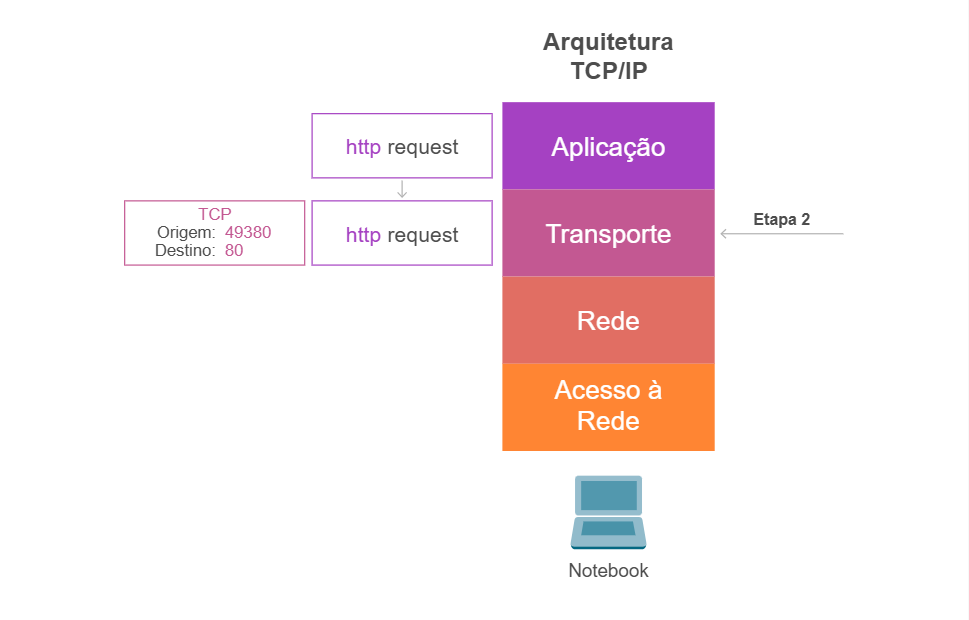

    
<code>IMAGEM | **Etapa 2**: a camada de transporte</code>

| | | | Arquitetura TCP/IP | |
| :---: | :---: | :---: | :---: | :---: |
| | **http** request | **Aplicação** | |
| **TCP**   Origem: 49380   Destino: 80 | **http** request | **Transporte** | Etapa 2 |
| | | **Rede** | |
| | | **Acesso à Rede** | |
| | | Notebook | |

As informações da requisição HTTP recebidas da camada de aplicação são concatenadas com as informações da camada de transporte na etapa 2. A esse agrupamento (frequentemente referenciado como ***PDU*** - *Protocol Data Unit*) é dado o nome de ***segmento***. Assim, quando falamos em segmento, estamos nos referindo à *PDU* da camada de transporte (que contém informações da própria camada e as informações da camada de aplicação)

(<a href="#readme-top">back to top</a>)

## Passo 3: A Camada de Rede

A camada de rede é responsável por receber a *PDU* da camada de transporte (o segmento) e acrescentar informações de endereçamento que permitam identificar o equipamento de origem e o equipamento de destino na comunicação. Em uma analogia à comincação por cartas, seria o equivalente a acrescentar o endereço do remetente e do destinatário, o que permitirá que a carta alcance seu destino e o receptor saiba o endereço caso deseje enviar uma outra carta em resposta.

O endereço utilizado na camada de rede é definido pelo protocolo ***IP*** (*Internet Protocol*) e comumente referenciado como endereço IP. Ao acrescentar as informações da camada de rede à *PDU* recebida da camada de transporte, temos um novo *PDU* que recebe o nome de ***pacote***. Então, quando nos referimos a pacote de dados, estamos nos referindo a uma *PDU* da camada de rede.

Além disso, a estrutura de endereços acrescentada pela camada de rede permitirá que os pacotes sejam roteados (seja realizado o roteamento) por meio de redes distintas até que alcancem o seu destino. Roteamento, neste caso, refere-se à escolha do melhor caminho entre uma origem e um destino, considerando que há a possibilidade de diversos caminhos entre uma origem e um destino na Internet.

Em nosso exemplo, a camada de rede acrescentará ao segmento recebido da camada de transporte o endereço IP do notebook (endereço IP 192.168.1.3) e o endereço IP do servidor (192.168.1.2).

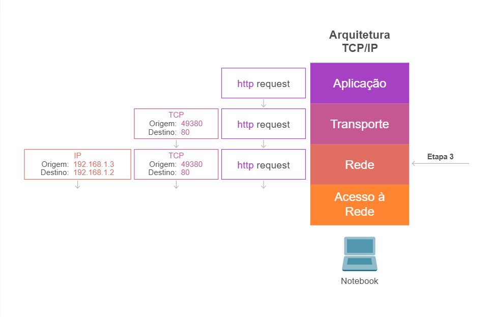

    
<code>IMAGEM | **Etapa 3**: a camada de rede</code>

| | | | | Arquitetura TCP/IP | |
| :---: | :---: | :---: | :---: | :---: | :---: |
| | | **http** request | **Aplicação** | |
| | **TCP**   Origem: 49380   Destino: 80 | **http** request | **Transporte** | |
| **IP**   Origem: 192.168.1.3   Destino: 192.168.1.2 | **TCP**   Origem: 49380   Destino: 80 | **http** request | **Rede** | Etapa 3|
| | | | **Acesso à Rede** | |
| | | | Notebook | |

O próximo passo será encaminhar o *pacote* (*PDU* da camada de rede) para a próxima camada: a camada de acesso à rede, também referenciada como camada de enlace ou de ligação de dados.

(<a href="#readme-top">back to top</a>)

## Passo 4: A Camada de Acesso à Rede

Pode-se compreender a camada de acesso à rede muito mais como um processo que poder ser controlado tanto em *software* (*device driver*) para a *interface de rede* (cabeada ou wireless) quanto em *firmware* ou *chipsets* especializados presentes no hardware. Esses executarão as funções da camada de acesso à rede, como adicionar endereços da interface de rede dos equipamentos aos pacotes recebidos na camada de rede e prepará-lo para transmissão por intermédio da camada física.

A camada de enlace executa muitas outras funções e acrescenta muitas outras informações que compõem um cabeçalho (*header*) aos pacotes recebidos da camada de rede.

O pacote recebido da camada de rede após receber as informações da camada de acesso à rede passa a se chamar ***quadro***. Assim, quando nos referimos a um quadro de dados, estamos nos referindo a uma *PDU* da camada de enlace.. Então, quando fazemos referência a um *quadro* (*frame*) em comunicação estamos fazendo referência à *P*DU* da camada de acesso à rede.

No nosso exemplo, a camada de acesso à rede na origem (notebook na LAN 1) acrescentará os endereços físicos (endereço MAC) da interface de rede que será utilizada pelo notebook para a transmissão do quadro e, ainda, o endereço físico (endereço MAC) da interface de rede do servidor que receberá o quadro (já que ele está na mesma rede, dado que esse procedimento seria um pouco diferente se o servidor estivesse em outra rede).

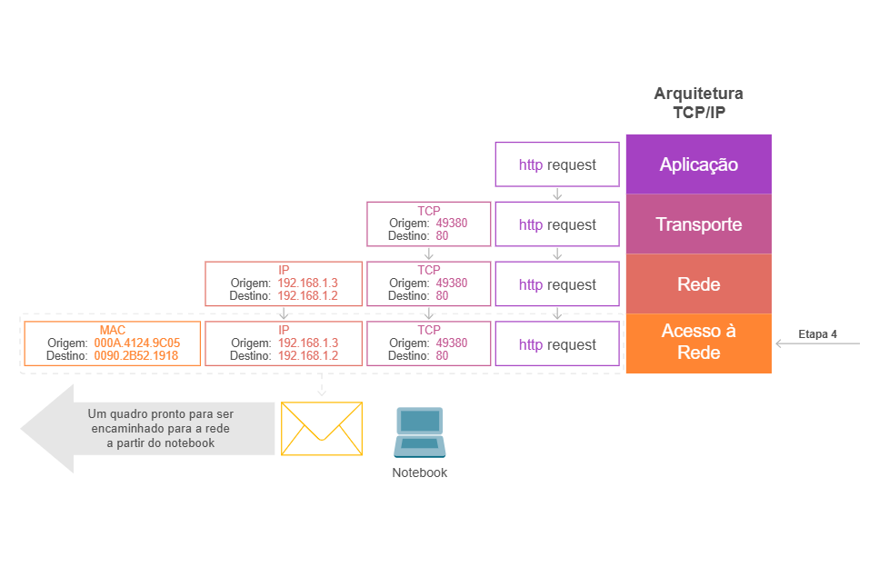

    
<code>IMAGEM | **Etapa 3**: a camada de rede</code>

| | | | | | Arquitetura TCP/IP | |
| :---: | :---: | :---: | :---: | :---: | :---: | :---: |
| | | | **http** request | **Aplicação** | |
| | | **TCP**   Origem: 49380   Destino: 80 | **http** request | **Transporte** | |
| | **IP**   Origem: 192.168.1.3   Destino: 192.168.1.2 | **TCP**   Origem: 49380   Destino: 80 | **http** request | **Rede** | |
| **MAC**   Origem: 000A.4124.9C05   Destino: 0090.2B52.1918 | **IP**   Origem: 192.168.1.3   Destino: 192.168.1.2 | **TCP**   Origem: 49380   Destino: 80 | **http** request | **Acesso à Rede** | Etapa 4 |
| | | | | Notebook | |

Um dado muito importante é que os quadros existem apenas no âmbito das redes locais. Quando o destino de um quadro for um equipamento fora da rede local, em vez da camada de enlace acrescentar o endereço MAC do equipamento de destino, acrescentará o endereço MAC da interface de *gateway* (porta do roteador que servirá de saída para a rede local). O *gateway* removerá as informações do quadro e encaminhará pacotes para a próxima rede. Assim, os pacotes serão roteados até alcançarem a rede de destino.

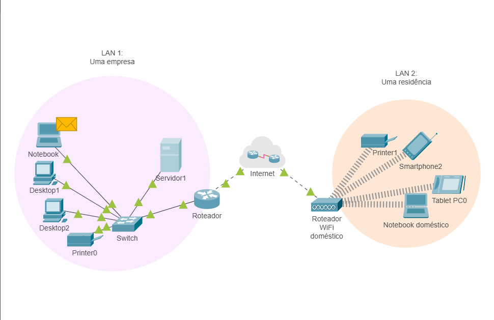

    
<code>IMAGEM | Um quadro pronto para ser encaminhado para a rede local</code>

| LAN 1   (empresa) | | LAN 2   (residência) |
|:---------:|:---:|:---------:|
| &#8595; &#8592; | Internet | &#8594; &#8595; |
| Roteador | | Roteador WiFi doméstico |
| Switch | | Printer1 |
| Servidor1 | | Smartphone2 |
| Printer0 | | Tablet PC0 |
| Notebook   ***quadro*** | | Notebook doméstico |
| Desktop1 | | |
| Desktop2 | | |

O quadro será transmitido pela rede local por intermédio do meio de transmissão existente (cabos metálicos de par trançado, sinal wireless etc.)

No exemplo, o notebook está conectado a um equipamento switch, que é um equipamento tipicamente de camada 2. Aqui cabe lembrar que, quando nos referimos a equipamentos, frequentemente utilizamos o modelo **OSI** e não mais a arquitetura **TCP/IP**. Assim,s eguindo o padrão de mercado, dizemos que o switch é um dispositivo de camada 2 do modelo *OSI* da *ISO* (camada de enlace). Uma vez que o switch é um equipamento de camada 2, possui capacidade para receber o quadro e interpretar as informações da camada 2 (ou de acesso à rede do modelo TCP/IP): ou seja, o switch é capaz de interpretar os endereços MAC adicionados pela camada de acesso à rede e fazer o encaminhamento do quadro para o seu destino, o servidor localizado na rede LAN 1.

O switch receberá o quadro encaminhado pela interface de rede do notebook por meio de transmissão existente e, em seguida, annalisará os endereços da camada 2 antes de encaminhar o quadro ao seu destino correto.

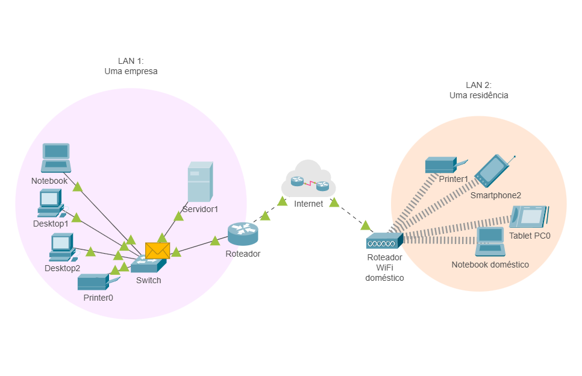

    
<code>IMAGEM | Análise do quadro pelo switch (1)</code>

| LAN 1   (empresa) | | LAN 2   (residência) |
|:---------:|:---:|:---------:|
| &#8595; &#8592; | Internet | &#8594; &#8595; |
| Roteador | | Roteador WiFi doméstico |
| Switch   ***quadro*** | | Printer1 |
| Servidor1 | | Smartphone2 |
| Printer0 | | Tablet PC0 |
| Notebook | | Notebook doméstico |
| Desktop1 | | |
| Desktop2 | | |

Ao alcançar seu destino, a interface de rede do servidor retirará o quadro do meio de transmissão e um processo inverso ocorrerá.

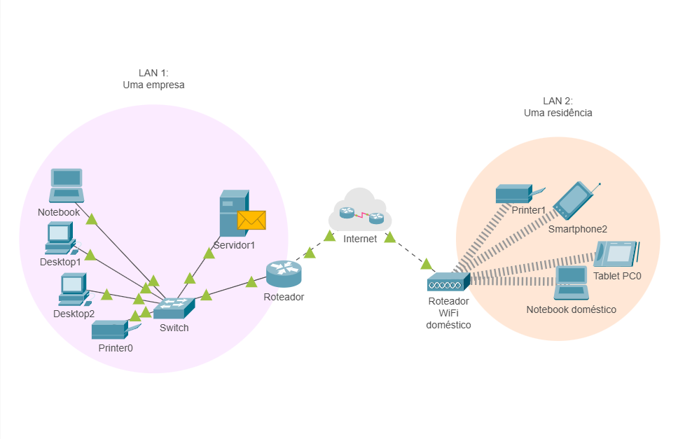

    
<code>IMAGEM | O quadro alcança o seu destino</code>

| LAN 1   (empresa) | | LAN 2   (residência) |
|:---------:|:---:|:---------:|
| &#8595; &#8592; | Internet | &#8594; &#8595; |
| Roteador | | Roteador WiFi doméstico |
| Switch | | Printer1 |
| Servidor1   ***quadro*** | | Smartphone2 |
| Printer0 | | Tablet PC0 |
| Notebook | | Notebook doméstico |
| Desktop1 | | |
| Desktop2 | | |

(<a href="#readme-top">back to top</a>)

## Análise Realizada pelos Protocolos no Destino

É possível identificar que cada camada tem como função adicionar informações respectivas à própria camada (um cabeçalho) aos dados do usuário a serem transmitidos para outro sistema. Desse modo, a função de cada camada do outro sistema é exatamente a inversa, ou seja, retirar os cabeçalhos dos dados que chegam e entregá-los ao usuário em sua forma original.

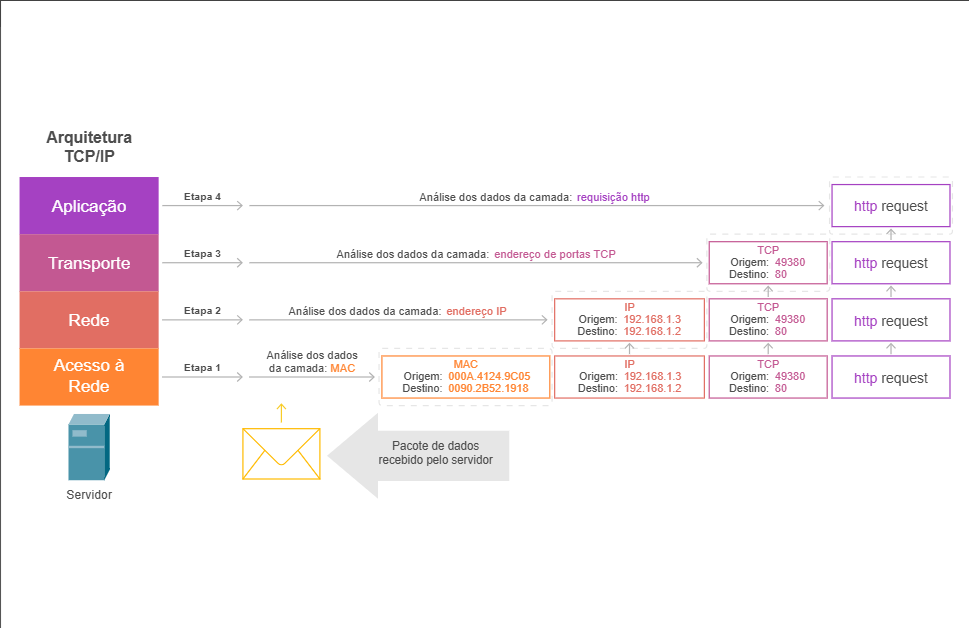

    
<code>IMAGEM | **Etapa 3**: a camada de rede</code>

| Arquitetura TCP/IP | | | | | | |
| :---: | :---: | :---: | :---: | :---: | :---: | :---: |
| **Aplicação** | Etapa 4 | Análise dos dados da camada: *requisição http* | | | | ***http** request* |
| **Transporte** | Etapa 3 | Análise dos dados da camada: *endereço de portas TCP* | | | **TCP**   Origem: 49380   Destino: 80 | ***http** request* |
| **Rede** | Etapa 2 | Análise dos dados da camada: *endereço IP* | | **IP**   Origem: 192.168.1.3   Destino: 192.168.1.2 | **TCP**   Origem: 49380   Destino: 80 | ***http** request* |
| **Acesso à Rede** | Etapa 1 | Análise dos dados da camada: *MAC* | **MAC**   Origem: 000A.4124.9C05   Destino: 0090.2B52.1918 | **IP**   Origem: 192.168.1.3   Destino: 192.168.1.2 | **TCP**   Origem: 49380   Destino: 80 | ***http** request* |
| **Servidor** | | &#8593;   Pacote de dados recebido pelo servidor | | | | | |

No exemplo, após receber o quadro pela interface de rede, o equipamento de destino (o servidor) passará a analisar as informações encaminhadas pela origem da comunicação (o notebook). Cada camada da arquitetura TCP/IP realizará a análise da informação encaminhada por sua camada equivalente na origem.

A camada de acesso à rede no servidor dará início à etapa 1: analisará as informações colocadas no quadro pela camada de acesso à rede do equipamento de origem. Em seguida, irá remover as informações do quadro e entregará o pacote à camada de rede, que dará início à segunda etapa.

Na segunda etapa, a camada de rede analisará as informações acrescentadas pela camada de rede do equipamento de origem, removendo essas informações em seguida e entregando o segmento para a camada de transporte.

A camada de transporte, ao receber o segmento, dará início à etapa 3, analisando as informações acrescentadas pela camada de transporte do equipamento de origem. As informações permitirão o encaminhamento da requisição à aplicação responsável pelo atendimento da requisição HTTP. A requisição será entregue à aplicação correta no servidor, que irá analisar e preparar a resposta.

Assim, uma resposta será preparada seguindo os mesmos passos descritos anteriormente: quando o notebook preparou uma requisição HTTP a ser encaminhada ao servidor. A resposta passará por todas as camadas no servidor, anhará o meio de transmissão e alcançará o notebook. Ao alcançar o notebook, a resposta passará por todas as camadas atré alcançar o navegadot web responsável pela requisição.

Finalmente a resposta será processada pelo navegador web e apresentada ao usuário.

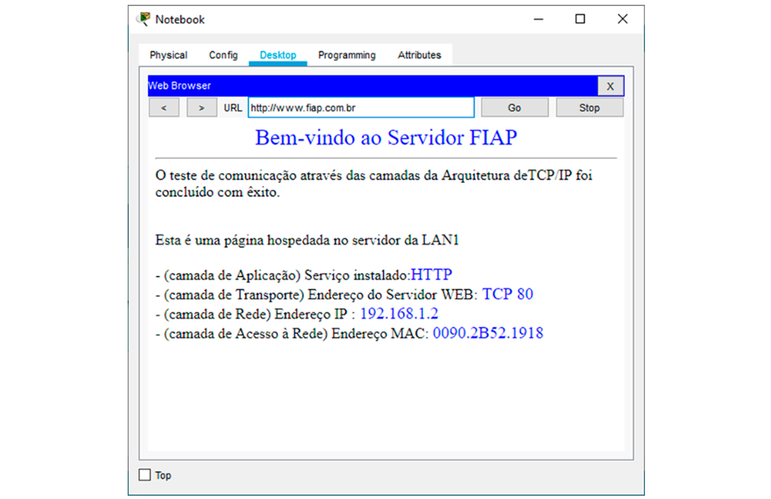

(<a href="#readme-top">back to top</a>)

