<span align=center>
    
[`main`](https://github.com/LoriaLawrenceZ/FIAP-2ESOA-F1/tree/main) | [`cap-1`](https://github.com/LoriaLawrenceZ/FIAP-2ESOA-F1/tree/cap-1) | [`cap-2`](https://github.com/LoriaLawrenceZ/FIAP-2ESOA-F1/tree/cap-2) | [`cap-3`](https://github.com/LoriaLawrenceZ/FIAP-2ESOA-F1/tree/cap-3) | [`cap-4`](https://github.com/LoriaLawrenceZ/FIAP-2ESOA-F1/tree/cap-4) | [`cap-5`](https://github.com/LoriaLawrenceZ/FIAP-2ESOA-F1/tree/cap-5) | [`cap-6`](https://github.com/LoriaLawrenceZ/FIAP-2ESOA-F1/tree/cap-6) | [`cap-7`](https://github.com/LoriaLawrenceZ/FIAP-2ESOA-F1/tree/cap-7) | [`cap-8`](https://github.com/LoriaLawrenceZ/FIAP-2ESOA-F1/tree/cap-8) | [`cap-9`](https://github.com/LoriaLawrenceZ/FIAP-2ESOA-F1/tree/cap-9) | [`cap-10`](https://github.com/LoriaLawrenceZ/FIAP-2ESOA-F1/tree/cap-10)

</span>

<div name="readme-top">
    <h1 align=center>CAPÍTULO 8</h1>
</div>

>**Capítulo 8 - Listas lineares, Pilhas e Filas em Java**

---

<details>
    <summary><span>📌 Índice</span></summary>

- [REPRESENTAÇÃO DE INFORMAÇÃO EM SISTEMAS COMPUTACIONAIS](#representação-de-informação-em-sistemas-computacionais)
  - [Tipos de Dados](#tipos-de-dados)
  - [Tipos Abstratos de Dados vs Tipos "Concretos" de Dados](#tipos-abstratos-de-dados-vs-tipos-concretos-de-dados)
- [ORGANIZANDO DADOS EM ESTRUTURAS DE *LISTAS LINEARES*](#organizando-dados-em-estruturas-de-listas-lineares)
  - [Lista Linear Especial: *PILHA*](#lista-linear-especial-pilha)
  - [Lista Linear Especial: *FILA*](#lista-linear-especial-fila)
  - [Como Construir Listas Lineares em Programas?](#como-construir-listas-lineares-em-programas)
  - [Lista Linear Encadeada](#lista-linear-encadeada)
  - [Lista Linear Encadeada em Java (Tipo Concreto de Dado)](#lista-linear-encadeada-em-java-tipo-concreto-de-dado)
- [LISTAS LINEARES ESPECIAIS: *PILHAS ENCADEADAS*](#listas-lineares-especiais-pilhas-encadeadas)
  - [Implementando o Tipo de Dado Pilha](#implementando-o-tipo-de-dado-pilha)
  - [Implementação em Java da Pilha de Inteiros](#implementação-em-java-da-pilha-de-inteiros)
  - [Exemplo de Uso do Tipo de Dado Pilha](#exemplo-de-uso-do-tipo-de-dado-pilha)
- [LISTAS LINEARES ESPECIAIS: FILAS ENCADEADAS](#listas-lineares-especiais-filas-encadeadas)
  - [Implementando o Tipo de Dado Fila](#implementando-o-tipo-de-dado-fila)
  - [Implementação de Fila em Java](#implementação-de-fila-em-java)
- [Exemplo de Uso do Fila](#exemplo-de-uso-do-fila)
- [EXERCÍCIOS DE FIXAÇÃO 1](#exercícios-de-fixação-1)
- [EXERCÍCIOS DE FIXAÇÃO 2](#exercícios-de-fixação-2)

</details>

---

# REPRESENTAÇÃO DE INFORMAÇÃO EM SISTEMAS COMPUTACIONAIS


<details close>
    <summary><code>IMAGEM | Esquema de entrada de dados, processamento e saída de resultados</code></summary>

Dados Metereológicos ->  PROCESSAMENTO -> Informações: possibilidade de chuva

</details>

<p align="right">(<a href="#readme-top">back to top</a>)</p>

## Tipos de Dados

O que é um tipo de dado?

> - São valores que podem ser assumidos.
> - Operações que possam ser efetuadas

Por exemplo, tipo de dado inteiro:

- Valores que representam quantidades contáveis de objetos.
- Operações: soma, subtração, multiplicação, divisão e resto da divisão.

Alguns tipos de dados são compreendidos diretamente pelo processador, ou seja, na arquitetura interna do processador estão presentes unidades de aritmética que realizam as operações sobre esses tipos de dados. Esses tipos são ditos *dados **primitivos***, normalmente, são númetos inteiros com ou sem sinal, reais e caracteres.

Para facilitar o uso de dados por programas, são definidos os tipos compoostos de dados, também conhecidos como *dados estruturados*, que são compostos internamente por vários dados primitivos ou não. Exemplos desses tipos de dados já estudados: vetores, matrizes e registros (dados de tipos diferentes são agrupados em um dado do tipo registro).

<p align="right">(<a href="#readme-top">back to top</a>)</p>

## Tipos Abstratos de Dados vs Tipos "Concretos" de Dados

> Deve-se distinguir tipos ***abstratos*** de dados e tipos ***concretos*** de dados

- ***Tipos abstratos de dados (TAD)***: especificam as propriedades lógicas e matemáticas de um tipo de dados ou estrutura, tornando-se guias úteis para os programadores. Desta forma, um **TAD** não precisa levar em consideração como será o tipo de dado concreto que será usado no computador.
- ***Tipos concretos de dados***: são aqueles escolhidos dentro das opções de tipos de dados oferecidos pela arquitetura do computador, ou seja, dentro das limitações inerentes do mundo digital.

Na definição de um TAD, não é usual a preocupação com tempo, eficiência de processamento ou limitações de espaço, que são problemas de implementação. Não vamos estudar todas as técnicas e notações de **TAD**s, mas, sim, o uso de algumas delas em problemas de programação, com a finalidade de elaborarmos códigos que usem eficientemente os dados no processamento de aplicações.

<p align="right">(<a href="#readme-top">back to top</a>)</p>

# ORGANIZANDO DADOS EM ESTRUTURAS DE *LISTAS LINEARES*

## Entendendo o que são Listas Lineares

<details close>
    <summary><code>VÍDEO | Definindo Listas Lineares Encadeadas</code></summary>

- Lista linear é uma estrutura de dados que armazena uma coleção de elementos em uma sequência linear.
- Lista linear encadeada é uma lista linear onde cada elemento contém um ponteiro para o próximo elemento da lista.

#### Como implementar e representar cada elemento de uma lista linear encadeada?

Cada elemento deve conter

- Dado que presica precisa ser armazenado na lista;
- Ponteiro ou referência de onde está o seu sucessor.

Elemento passa a ser chamada de **NÓ** ou **NODO**

- Dado | Ponteiro para o próximo nó

#### Declaração de cada nó em linguagem algorítmica

**NÓ**
- *Início*
    - **Dado**: tipo_do_elemento da lista
    - **Próximo**: ponteiro para o próximo nó
- *Fim*

LISTA
- | Dado 01 | Referência | -> | Dado 02 | Referência | -> | Dado 03 | Referência | -> FIM

</details>

No dia a dia, temos a necessidade de agrupas dados que apresentam alguma relação e que precisamos lembrar. Normalmente, criamos listas como:

- Listas de compras para irmos ao supermecado
- Listas de tarefas a serem realizadas no trabalho
- Listas de convidados para um festa etc.

Em desencolcimento de sistemas de computação, também são necessárias listas. Exemplos:

- Listas de arquivos a serem impressos
- Lista de solicitações de acesso para consulta de servidor de um banco de dados etc.

Contudo, analisando as aplicações que usam listas em computação, podemos observar que não basta criar um conjunto de elementos, precisamos, sim, definir uma ordem para que sejamos justos com os usuários que solicitaram algum serviço. Assim:

> Lista de arquivos a serem impressos:
>
> - Se vários usuários solicitam a impressão de arquivos, é justo que o primeiro que solicitou seja o primeiro a ser impresso.
>
> Lista de solicitações de acesso para consulta de um banco de dados:
>
> - Se vários clientes de um banco solicitam o saldo, o atendimento deve atender ao primeiro a pedir.

Portanto, fica claro que devemos criar listas nas quais possamos garantir algum tipo de ordenação. Este tipo de lista é conhecido como ***lista linear***.

> **DEFINIÇÃO**: Uma lista linear é uma estrutura de dados que, além de armazenas vários valores de elementos, impõe que a posição de cada elemento deve respeitar algum tipo de ordem.

Usando o formalistmo adequado para o estudo de lista linear, define-se que é uma estrutura dinâmica caracterizada por uma sequência ordenada de elementos, ordenada no sentido de sua posição relativa: E0, E1, E2, ..., En-1, tal que:

- Existem *n* elementos na sequência
- E0 é o primeiro elemento da sequência
- En-1 é o último elemento da sequência
- Para todo i e j entre 0 e n-1, se i < j, então Ei antecede Ej
- Caso i = j-1, Ei é antecessor de Ej e Ej é sucessor de Ei

A característica principal de uma lista linear é o sentido da ordem unidirecional dos elementos que a compõem. O critério usado para essa ordenação é bem genérico, podendo ser definido em função do problema que está sendo modelado.

Dentre as diversas operações que podem ser realizadas com listas, temos:

- Ter acesso a um elemento qualquer da lista (acesso).
- Inserir um elemento em uma posição específica da lista (inserção).
- Remover um elemento de uma posição específica da lista (remoção).
- Combinar duas listas em apenas uma.
- Particionar (dividir) uma lista em duas listas.
- Determinar o total de elementos da lista etc.

<details close>
    <summary><code>VÍDEO | Construindo Lista Linear Encadeada</code></summary>

#### Definição de NÓ em Java

Uma classe com 2 atributos

- Campo do tipo de dado
- Campo do tipo NÓ

```java
// declaração do no e dos atributos
private static class NO {
    public int dado;
    public NO prox;
}
```

#### Iniciando na lista vazia e depois inserindo um elemento

```java
public static void main(String[] args) {
    NO lista = null; // Lista vazia
}
```

> NULL é um valor especial que indica que a variável não está apontando para nenhum objeto.

```java
for(int i = 1; i <= 2; i++) {
    NO novo = new NO(); // Cria um novo nó
    novo.dado = i + 4; // Atribui o valor ao nó
    novo.prox = lista; // O próximo nó é o que já existe na lista
    lista = novo; // A lista agora é o novo nó
}
```

</details>

<p align="right">(<a href="#readme-top">back to top</a>)</p>

## Lista Linear Especial: *PILHA*

Uma pilha (***stack***) é uma lsita linear qual as operações de inserção e de remoção são efetuadas apenas em uma extremidade, denominada topo da pilha. Estruyturas deste tipo são conhecidas como ***LIFO*** (*Last In First Out*).

> Pilhas são usadas em aplicações em que é necessário que a ordem de saída dos elementos seja inversa à ordem de entrada. Por exemplo, em um editor de texto, quando o usuário clica no botão "desfazer", o último caractere digitado é retirado do texto.


<details close>
    <summary><code>IMAGEM | Estrutura de uma lista linear do tipo PILHA</code></summary>

| | |
| :---: | :---: |
| Elemento n-1 | topo da Pilha |
| ... | |
| Elemento 2 | |
| Elemento 1 | |
| Elemento 0 | base da Pilha |

</details>

<p align="right">(<a href="#readme-top">back to top</a>)</p>

## Lista Linear Especial: *FILA*

Uma fila (***queue***) é uma lista linear na qual a operação de inserção é feita em uma extremidade denominada final da fila e a remoção é efetuada apenas na outra extremidade denomidade início. Estruturas deste tipo são conhecidas como ***FIFO*** (*First In First Out*)


<details close>
    <summary><code>IMAGEM | Estrutura de uma lista linear do tipo FILA</code></summary>

| Início da fila| | | | Final da Fila |
| :---: | :---: | :---: | :---: | :---: |
| Elemento 0 | Elemento 1 | Elemento 2 | ... | Elemento n-1 |

</details>

<p align="right">(<a href="#readme-top">back to top</a>)</p>

## Como Construir Listas Lineares em Programas?

- ***Implementação estática***: é usado vetor para armazenar os elementos da lista, por exemplo, armazenar como elementos do vetor os nomes das pessoas que entraram na fila do banco. Por usar vetor, a ordenação é garantida pela posição do elemento dentro do vetor.


<details close>
    <summary><code>IMAGEM | Estrutura de uma FILA usando vetor para implementação estática</code></summary>

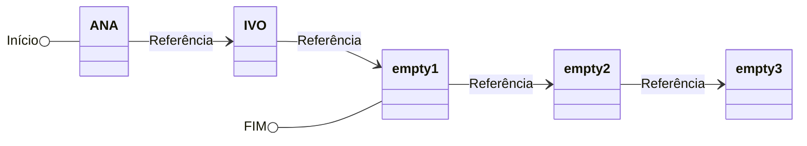
```mermaid
---
title: 
---
classDiagram
direction LR
    class ANA
    class IVO
    class empty1
    class empty2
    class empty3
    ANA --> IVO : Referência
    IVO --> empty1 : Referência
    empty1 --> empty2 : Referência
    empty2 --> empty3 : Referência

    Início ()-- ANA
    FIM ()-- empty1
```

</details>

- ***Implementação dinâmica***: deve-se criar espaço na memória para armazenar cada elemento da lista conforme a aplicação requer mais um elemento, isso é chamado de alocação dinâmica, aloca (reserva local) espaço na memória para um dado enquanto o programa está sendo executado.

<p align="right">(<a href="#readme-top">back to top</a>)</p>

## Lista Linear Encadeada

Para que seja uma lista linear encadeada, é necessário que cada elemento tenha a indicação (ponteiro) de onde se encontra o elemento que é o seu sucessor.

Para que isto possa ocorrer, cada elemento deve se tornar:


<details close>
    <summary><code>IMAGEM | Esquema de um nó que armazena um elemento de uma lista linear encadeada</code></summary>

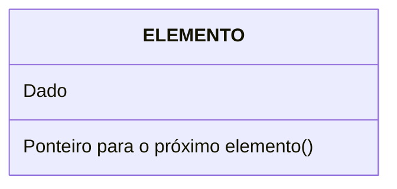
```mermaid
---
title: 
---
classDiagram
direction LR
    class ELEMENTO {
        Dado
        Ponteiro para o próximo elemento()
    } 
```

</details>

Como agora cada elemento da lista, além do dado, sempre terá a informação de localização do elemento sucessor, esse elemento passa a ser chamado de ***nó*** ou ***nodo*** (*node* em inglês).

Para o exemplo da sequência de alocação de elemento, tem-se:


<details close>
    <summary><code>IMAGEM | Esquema de alocação de nós de uma lista linear encadeada</code></summary>

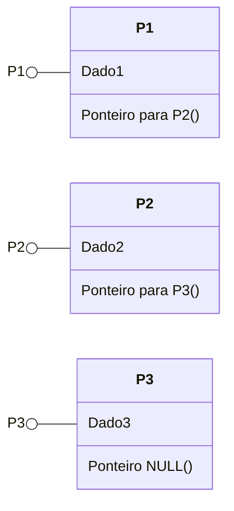
```mermaid
---
title: 
---
classDiagram
direction LR
    class P1 {
        Dado1
        Ponteiro para P2()
    }
    class P2 {
        Dado2
        Ponteiro para P3()
    }
    class P3 {
        Dado3
        Ponteiro NULL()
    }

    P1 ()-- P1
    P2 ()-- P2
    P3 ()-- P3
```

</details>

Uma forma diferente de representar a lista linear encadeada, ela é feita sabendo que ponteiros são sempre representados como setas que mostram uma área de memória. Neste caso, o ponteiro para o próximo de cada nó indica a área de memória que armazena um nó. A forma mais comum de representar o encadeamento de nós é apresentada:


<details close>
    <summary><code>IMAGEM | Esquema de encadeamento de nós de uma lista linear encadeada</code></summary>

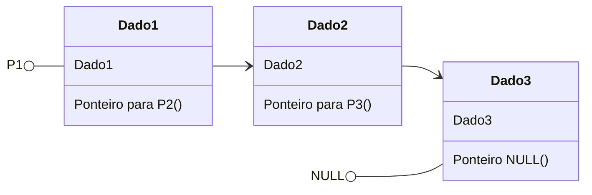
```mermaid
---
title: 
---
classDiagram
direction LR
    class Dado1 {
        Dado1
        Ponteiro para P2()
    }
    class Dado2 {
        Dado2
        Ponteiro para P3()
    }
    class Dado3 {
        Dado3
        Ponteiro NULL()
    }

    Dado1 --> Dado2
    Dado2 --> Dado3

    P1 ()-- Dado1
    NULL ()-- Dado3
```

</details>

Observe que o nó que tem **Dado3** tem como ponteiro **prox** a indicação que não há nó sucessor.

Com esta nova forma de representar uma lista, como fica a declaração de cada nó?

```pt-br
NO
Inicio
    dado: tipo_do_elemento da lista
    prox: ponteiro para o próximo nó
Fim
```

Observe que o NO tem como campos:

- O dado que será do tipo de dado a ser armazenado na lista
- O ponteiro prox que aponta para o nó sucessor. Assim, o campo prox é um ponteiro para outro nó, ou seja, para outro registro nó. Esse tipo de declaração é dita recursiva.

<p align="right">(<a href="#readme-top">back to top</a>)</p>

## Lista Linear Encadeada em Java (Tipo Concreto de Dado)

Para mostrar como é feita a declaração de um nó de uma lista encadeada em JAVA, supõe-se que os elementos a serem armazenados sejam do tipo ineiro. O nó em JAVA precisa ser do tipo classe NO, pois deve ser composto pelo atributo dado e também pelo atributo prox (ponteiro que aponta para o póximo nó).

```java
private static class No {
    public int dado;
    public No prox;
}
```

Vamos iniciar o estudo de listas lineares com um exemplo muito pequeno, apresentado a seguir:

```java
public class Lista_Encadeada_Simples {
    
    //declaração do nó e dos atributos
    private  static class NO {
        public int dado;
        public NO prox;
    }


    public static void main(String[] args) {
        //inicia lista vazia atribuindo null ao ponteiro lista
        NO lista = null;
        System.out.println("Valor ponteiro lista= " + lista);

        //	um nó é alocado e é inserido na lista
        NO novo = new NO();
        novo.dado=5;
        novo.prox = lista;
        lista = novo;		
        
        System.out.println("Atributos do nó apontado por  lista= " + lista.dado +" "+lista.prox);
    }
}
```

A variável lista declarada do tipo classe NO, quando a instanciamos, a classe NO é retornada uma referência ao objeto NO, portanto, a lista é considerada um ponteiro para NO. Em seguida, é atribuído à variável lista o valor null (constante 0). Representaremos essa atribuição como:


<details close>
    <summary><code>IMAGEM | Ponteiro lista indicando que lista linear está vazia</code></summary>

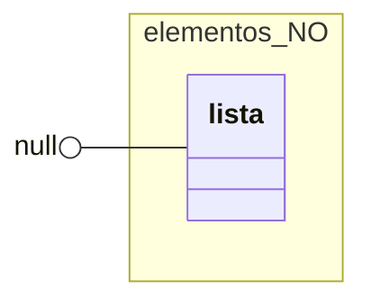
```mermaid
---
title: 
---
classDiagram
direction LR
    namespace elementos_NO {
        class lista {
        }
    }

    null ()-- lista
```

</details>

Essa representação será usada quanto tivermos uma lista vazia, ou seja, quando o ponteiro que deve indicar para a lista que não tem nenhum nó referenciado. Para inserir um  nó na lista linear, o programa prossegue, fazendo a alocação do nó e usando o ponteiro novo que mostra o NO alocado.


<details close>
    <summary><code>IMAGEM | Esquema de alocação de novo nó e ponteiro lista indicando que lista linear está vazia</code></summary>

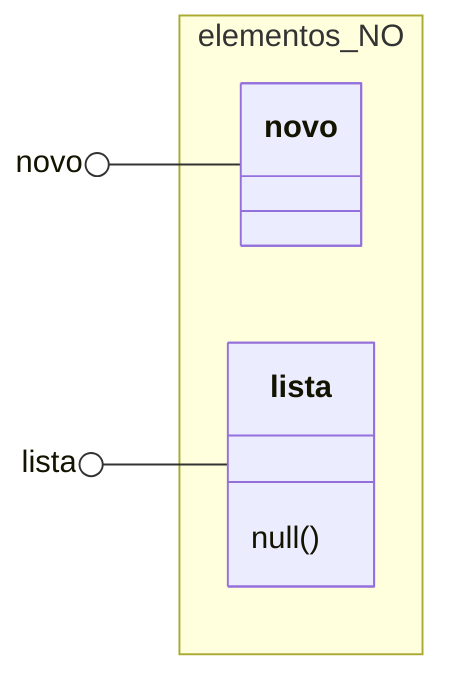
```mermaid
---
title: 
---
classDiagram
direction LR
    namespace elementos_NO {
        class novo {
        }

        class lista {
            null()
        }
    }

    novo ()-- novo
    lista ()-- lista
```

</details>

Realizando a execução do próximo comando, novo.dado = 5, é atribuído ao atributo dado no NO apontado pelo ponteiro novo, o valor 5.

Finalmente, com o comando novo.prox = lista, o ponteiro prox recebe o ponteiro lista. Quando isso acontece, dizemos que prox aponta para o mesmo lugar que o ponteiro lista, que nesse caso, indica para null, representando assim, que não há elemento sucessor.

O programa encerra com o ponteiro lista recebendo o ponteiro novo e, como acabamos de ver, isso significa que o ponteiro lista deixa de apontar para null e passa a indicar o mesmo nó apontado por novo.


<details close>
    <summary><code>IMAGEM | Esquema de inserção de valores no novo nó alocado e ponteiro lista indicando que lista linear está vazia</code></summary>

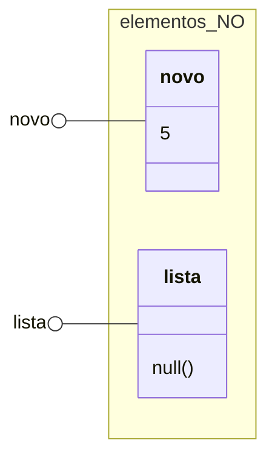
```mermaid
---
title: 
---
classDiagram
direction LR
    namespace elementos_NO {
        class novo {
            5
        }

        class lista {
            null()
        }
    }

    novo ()-- novo
    lista ()-- lista
```

</details>


<details close>
    <summary><code>IMAGEM | Esquema da lista com um nó alocado</code></summary>

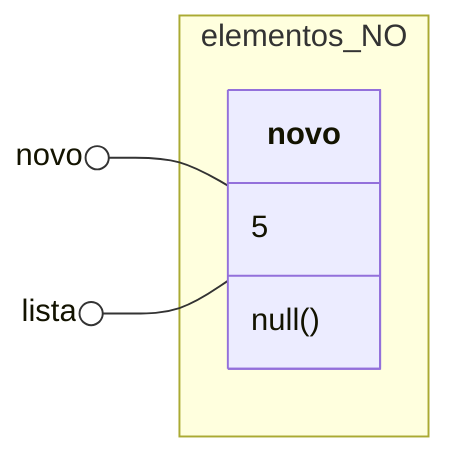
```mermaid
---
title: 
---
classDiagram
direction LR
    namespace elementos_NO {
        class novo {
            5
            null()
        }
    }

    novo ()-- novo
    lista ()-- novo
```

</details>

Um exemplo com alocação de 2 nós em Java:

```java
public class Lista_Simples_2_nos {

	private  static class NO {
	    public int dado;
		public NO prox;
    }

	public static void main(String[] args) {
		
		NO lista = null;
		System.out.println("Valor ponteiro lista= " + lista);
		for(int i =1; i<=2;i++) {
			NO novo = new NO();
			novo.dado= i+4;
			novo.prox = lista;
			lista = novo;					
		}

		System.out.println("Dado do NO apontado por lista= "+lista.dado);
		System.out.println("Dado do NO apontado por prox " +lista.prox.dado);
	}
}
```


<details close>
    <summary><code>IMAGEM | Esquema da lista com segundo nó alocado e inserido</code></summary>

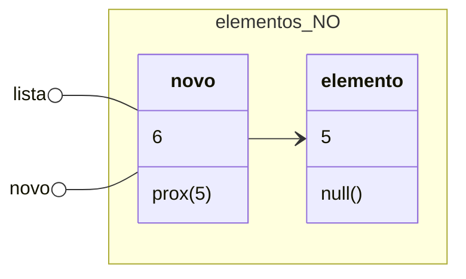
```mermaid
---
title: 
---
classDiagram
direction LR
    namespace elementos_NO {
        class novo {
            6
            prox(5)
        }

        class elemento {
            5
            null()
        }
    }

    novo --> elemento

    lista ()-- novo
    novo ()-- novo
```

</details>

Como percorrer uma lista inteira com muito snós para apresentar cada um de seus dados? Basta que usemos um ponteiro auxiliar que chamemos aqui de aux. O ponteiro aux deve iniciar indicando o nó apontado por lista e, depois de exibir na tela de saída o dado, o ponteiro aux deve passar a apontar o nó sucessor (aux.prox).

```java
aux=lista;
while (aux!=null) {
    System.out.println("Dado do NO apontado por prox " +aux.dado);
    aux = aux.prox;
}
```

Com esse conhecimento básico sobre listas lineares encadeadas, vamos praticar a implementação e a manipulação de listas, construindo, também, istas encadeadas especiais: Pilha e Fila.

<p align="right">(<a href="#readme-top">back to top</a>)</p>

# LISTAS LINEARES ESPECIAIS: *PILHAS ENCADEADAS*

Operações do tipo de dado PILHA são definidas as seguintes operações:

- Básicas
    - **PUSH** (P, v): armazena (empurra) na extremidade conhecida como topo da pilha P o elemento com valor v, aumentando o tamanho da pilha.
    - **POP** (P, v): retira do topo da pilha P o elemento e armazena o valor do elemento em v, diminuindo a pilha.
    - **TOP** (P, v): lê o elemento que está no topo da pilha P e armazena o valor do elemento em v.
- Auxiliares
    - **INIT** (P): inicializa a pilha P, tornando-a vazia.
    - **IsEmpty** (P): verifica se a pilha está vazia, retornando verdade se a pilha estiver vazia e falso, caso contrário.
    - **IsFull** (P): verifica se a pilha está cheia, retornando verdade se estiver a pilha cheia e falso, caso contrário.

Exemplo de realização de operações sobre uma pilha P, em que cada elemento armazena um valor inteiro.

| Operações | Estado da Pilha P depois da operação | v |
| :--- | :--- | :--- |
| INIT (P) | {} | |
| PUSH (P, 2) | {2} | |
| PUSH (P, 4) | {2, 4} | |
| TOP (P, v) | {2, 4} | 4 |
| POP (P, v) | {2} | 4 |
| PUSH (P, 5) | {2, 5} | |
| POP (P, v) | {2} | 5 |
| POP (P, v) | {} | 2 |

Descrevendo de forma resumida, a a´plicação da execução das operações apresentadas no quadro:

- A operação INIT(P) faz com que a estrutura de dados pilha seja iniciada como vazia.
- A execução da operação PUSH (P, 2) insere na pilha P que estava vazia o valor 2, que passa a ser o elemento que está no topo da pilha.
- A execução da operação PUSH (P, 4) insere na pilha P que estaca com o elemento 2 o valor 4, que passa a ser o elemento que está no topo da pilha.
- A execução da operação TOP (P, v)  faz a leitura do valor do elemento que está no topo da pilha P, porém a pilha não é alterada.
- A operação POP (P, v) faz a retirada do elemento que está no topo da pilha P, neste caso o valor 4, a pilha diminui de tamanho.

Como mencionado, uma lista linear PILHA é usada quando precisamos inverter a ordem de entrada dos elementos.

Suponha o seguinte tabuleiro com coordenadas [linha; coluna]. O caminho destacado deve ser o trajeto a ser programado em um robô para que ele caminhe no tabuleiro até chegar a um determinado ponto dele; e depois, deve voltar ao ponto de onde partiu refazendo exatamente o mesmo trajeto. Assim:


<details close>
    <summary><code>IMAGEM | Esquema de tabuleiro para ensinar trajeto para um robô</code></summary>

| | 1 | 2 | 3 | 4 |
| :---: | :---: | :---: | :---: | :---: |
| 1 | X | X |  |  |
| 2 |  | X |  |  |
| 3 |  | X | X | X |
| 4 |  |  |  |  |

</details>

- O caminho de ida deve ser: [1; 1] -> [1; 2] -> [2; 2] -> [2; 3] -> [3; 3] -> [3; 4]
- O caminho de volta deve ser: [3; 4] -> [3; 3] -> [2; 3] -> [2; 2] -> [1; 2] -> [1; 1]

Para essa aplicação, teríamos que usar uma pilha, uma vez que o caminho de volta deve ser exatamente o inverso da ida. Assim, devemos executar as operações descritas no quadro a seguir no programa a ser instalado no robô.

| Operação | Pilha | Posição |
| :--- | :--- | :--- |
| INIT (pilha) | {} | |
| PUSH (pilha, [1; 1]) | {[1; 1]} | |
| PUSH (pilha, [1; 2]) | {[1; 1], [1; 2]} | |
| PUSH (pilha, [2; 2]) | {[1; 1], [1; 2], [2; 2]} | |
| PUSH (pilha, [2; 3]) | {[1; 1], [1; 2], [2; 2], [2; 3]} | |
| PUSH (pilha, [3; 3]) | {[1; 1], [1; 2], [2; 2], [2; 3], [3; 3]} | |
| PUSH (pilha, [3; 4]) | {[1; 1], [1; 2], [2; 2], [2; 3], [3; 3], [3; 4]} | |
| POP (pilha, [3; 4]) | {[1; 1], [1; 2], [2; 2], [2; 3], [3; 3]} | [3; 4] |
| POP (pilha, [3; 3]) | {[1; 1], [1; 2], [2; 2], [2; 3]} | [3; 3] |
| POP (pilha, [2; 3]) | {[1; 1], [1; 2], [2; 2]} | [2; 3] |
| POP (pilha, [2; 2]) | {[1; 1], [1; 2]} | [2; 2] |
| POP (pilha, [1; 2]) | {[1; 1]} | [1; 2] |
| POP (pilha, [1; 1]) | {} | [1; 1] |

<p align="right">(<a href="#readme-top">back to top</a>)</p>

## Implementando o Tipo de Dado Pilha

Para construir o tipo de dado PILHA ENCADEADA deve-se definir o nó, que armazena a informação a ser organizada como pilha e que agora precisa ter incluída a indicação do próximo elemento da pilha.

Representando em TAD:

```pt-br
Registro NO
    Inicio
	    dado: do tipo_dos_elementos
	    prox: ponteiro para registro NO
    Fim
```

Para implementar uma pilha, não apenas é definido o nó que armazena cada elemento, mas também indicar a extremidade que representa o topo da pilha

```java
public class Pilha_INT {
  
	private static class NO{
	    public  int dado;
	    public  NO prox;
	}
	
	private static NO topo;
    ...
```

### Operações com Pilha

<details close>
    <summary><code>Operações | INIT</code></summary>

#### INIT

Lembrando que a pilha deve estar vazia no momento de sua criação. A função **INIT** deve deixar a indicação que o topo da pilha não aponta para um nó. EM linguagem algorítimica, será definida uma constante denominada NULO que indica que o topo está apontando para nenhum nó.


</details>

<details close>
    <summary><code>Operações | ISEMPTY</code></summary>

#### ISEMPTY

Verifica se a pilha está vazia. Retornando verdade se estiver vazia, caso contrário retorna faldo.


</details>

<details close>
    <summary><code>Operações | PUSH</code></summary>

#### PUSH

Esta operação deve primeiro alocar mais um nó e em seguida "encaixar" esse novo nó como o nó que fica no topo da pilha


1. Supondo que a pilha está vazia, depois do ALOCA(), o nó está alocado e é apontado por novo:

- 2. Como o novo nó passa a ser o topo da pilha, este novo nó deve indicar quie seu sucessor é o local que era o topo da pilha antes da inserção do novo nó (apontado por novo). Assim, o campo prox passa a apontar para o mesmo local que o ponteiro topo aponta, como a pilha estava vazia, o campo prox recebe NULO. Em seguida, o campo dado do novo nó recebe o valor 3 passado como parâmetro para o módulo push.

- 3. Posicionando o topo para apontar a pilha em sua nova configuração, lembre-se que na pilha o topo deve apontar para o último elemento que foi inserido.

</details>

<details close>
    <summary><code>Operações | TOP</code></summary>

#### TOP

Esta operação retorna o valor do dado do nó que está no topo da pilha caso a pilha não estiver vazia.

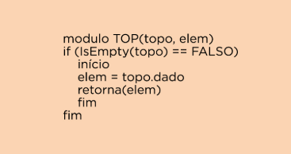

</details>

<details close>
    <summary><code>Operações | POP</code></summary>

#### POP

Esta operação deve considerar que só poderá retirar um nó se a pilha não estiver vazia. No algoritmo a seguir, o módulo POP verifica se a pilha não está vazia utilizando a operação IsEmpty() que retorna verdade se a pilha estiver vazia.

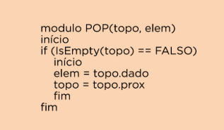

</details>

Supondo a pilha que foi gerada na explicação da operação PUSH (que terminou com apenas um elemento com dado 3) e, em seguida, executando a operação POP (topo, elm) para exemplificar:

1. Inicialmente a pilha está com apenas 1 nó e otopo aponta para este

2. Com a atribuição elem = topo.dado o valor 3 é atribuído parâmetro elem e, em seguida, topo = topo.prox fazendo com que o ponteiro topo passe a apontar para o mesmo local onde o campo prox aponta, ou seja, NULO

3. Com a liberação da área do nó com dado 3, a configuração final da pilha é que topo aponta para NULO

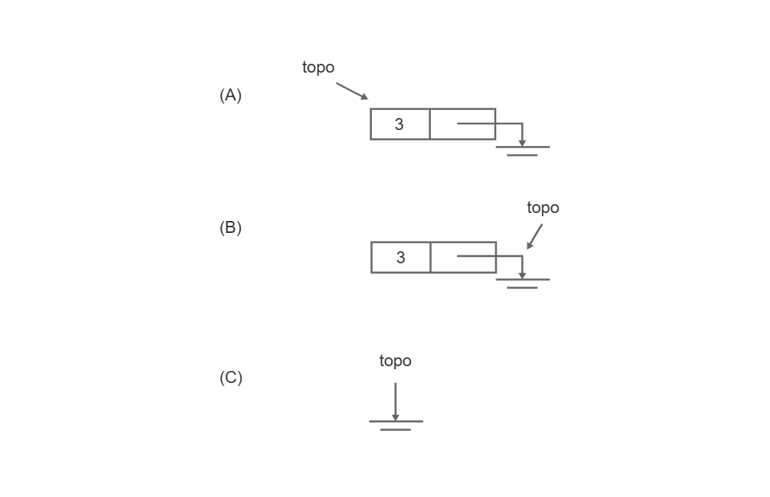

<p align="right">(<a href="#readme-top">back to top</a>)</p>

## Implementação em Java da Pilha de Inteiros

```java
import java.util.*;

public class Pilha_INT {

    //definição do NO
    private static class NO{
        public  int dado;
        public  NO prox;
    }

    //definição do retornos dos métodos POP e TOP
    private static class Retorno{
        public  int item;
        public  boolean ok;
    }
    //definição do ponteiro topo da pilha	
    private static NO topo;

    public void INIT() {
        topo = null;
    }

    public boolean IsEmpty() {
        return topo == null;
    }

    public void PUSH(int item) {
        NO novo = new NO();
        novo.dado = item;
        novo.prox = topo;
        topo = novo;
    }

    public Retorno POP() {
        Retorno saida = new Retorno();
        
        if(!IsEmpty()) {
            saida.item = topo.dado;
            topo = topo.prox;
            saida.ok = true;
        } else {
            saida.ok = false;
        }

        return saida;
    }

    public Retorno TOP() {
        Retorno saida = new Retorno();

        if(!IsEmpty()) {
            saida.item = topo.dado;
            saida.ok = true;
        } else {
            saida.ok = false;
        }

        return saida;
    }

    //Função main que exemplifica a utilização das operações sobre pilha
    public static void main(String[] args) {
            
        Pilha_INT s = new Pilha_INT();
        Scanner entrada = new Scanner(System.in);

        //Declaração de variáveis necessárias para usar métodos da Pilha_INT
        int item ;
        int opcao;
        Retorno res = new Retorno();

        //inicia a pilha fazendo topo = null
        s.INIT();	
        
        //invoca metodo TOP para obter dado do nó do topo da pilha
        res = s.TOP();
        if (res.ok) {
            System.out.println("Execução do TOP: "+  res.item);

        } else {
            System.out.println("Execução do TOP: pilha VAZIA");
        }

        //repetição para inserir elementos na pilha
        do { 
            System.out.println("Digite valor inteiro para dado  ");
            
            item= entrada.nextInt();
            
            s.PUSH(item);
            
            System.out.println("Digite 0 para encerrar empilhamento de dados  ");
            
            opcao=entrada.nextInt();
        } while (opcao != 0);
        
        //invoca metodo TOP para obter dado do nó do topo da pilha		
        res = s.TOP();

        if (res.ok) {
            System.out.println("Execução do TOP: " + res.item);
        }
            
        //repetição para retirar e apresentar todos elementos da pilha	
        do {
            res = s.POP();
        
            if (res.ok) {
                System.out.println("Dado retirado: " + res.item);	
            }
        } while (res.ok);

        entrada.close();
    }
}
```

Na main() é possível notar que foi necessário declarar algumas variáveis que são necessárias para utilização dos métodos. A única que merece comentário é a *res*, como os métodos TOP() e POP() podem ser invocados quando a pilha está vazia e se isso acontecer não há dado para ser retornado, torna-se preciso que, não apenas o valor do dado retorne, mas também se a operação foi um sucesso ou não. Assim, se  a pilha não está vazia, o dado pode ser retornado e está tudo ok (*true* - é verdade que a operção foi um sucesso). Portanto, o tipo de retorno dos métodos TOP() e POP() foi alterado para o tipo Retorno, pois assim o dado e a situação OK ou não são retornados juntos.

A pilha incia sendo colocada no estado "vazia" usando o método **INIT()**.

Logo após, foi feita a invocação do método **TOP(res)** e como a pilha está vazia é retornado o valor de OK é false, uma vez que não há nó inserido na pilha.

No programa os dados são inseridos na pilha fazendo uso de uma repetição que lê do teclado o valor da variável item e depois invoca o método **PUSH(item)** para inserir novo nó tendo o valor de item como campo dado.

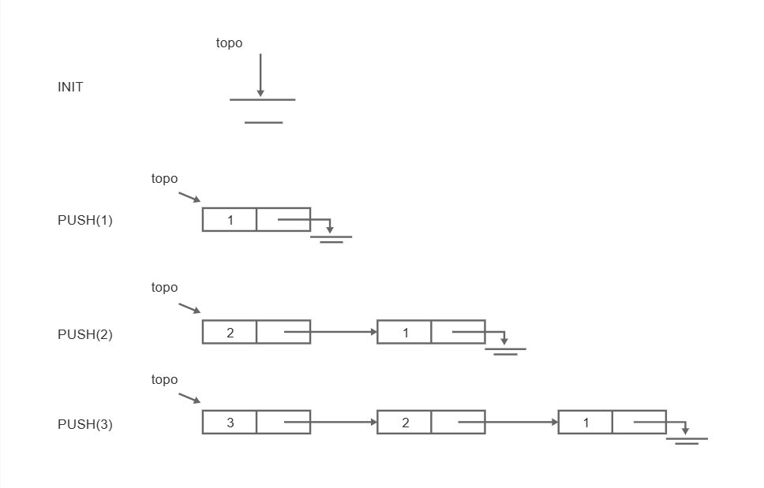

Continuando a execução do programa, mais uma vez é feita a invocação do método **TOP(res)**, só que desta vez a pilha não está vazia. Desta forma, o atributo ok de *res* recebe o valor *true* e assim o valor do dado que está no topo da pilha é apresentado na tela de saída (*res.item*).

Finalmente, o programa termina com a retirada de todos os nós da pilha e apresentação dos dados contidos em cada nó. Para realizar essa etapa, mais uma vez foi utilizado res que recebe do método **POP(res)** os valores para os atributos ok (*true* no caso da pilha não vazia e nó removido e *false* caso contrário) e item que terá apenas valor válido (valor do dado que está no topo da pilha) no caso de ok = true.. Sendo assim, a repetição fará com que POP seja executado até o momento em que a pilha estiver vazia.

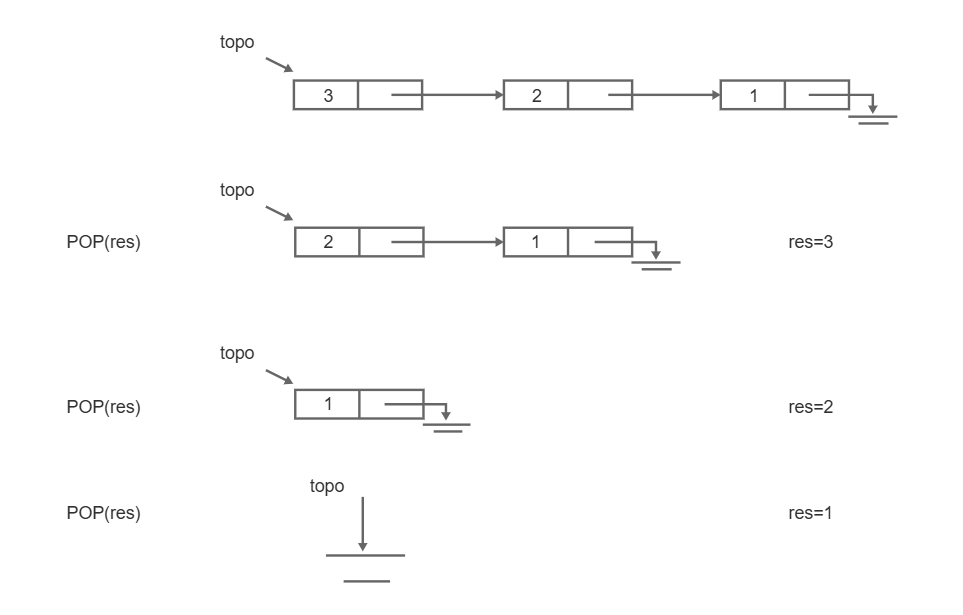

<p align="right">(<a href="#readme-top">back to top</a>)</p>

## Exemplo de Uso do Tipo de Dado Pilha

Suponha o seguinte problema: a conversão de um número representado em decimal em binário. Apenas para recordar como essa conversão é feita, suponha o valor 9 em decimal:

> 13/2 = 6 resto 1
> 6/2 = 3 resto 0
> 3/2 = 1 resto 1
> 1/2 = 0 resto 1

O valor na base 2 é obtido escrevendo o resto na ordem inversa em que foram obtidos, assim, o valor 9 em decimal é 1001 em binário. (1x2³ + 0x2² + 0x2¹ + 1x2⁰ = 8 + 0 + 0 + 1 = 9).

Para resolver o probelam, basta lembrar do funcionamento da pilha, que inverte a ordem em que os elementos foram inseridos. Desta forma, cada resto obtido é inserido na pilha e, quando a divisão obter resultado da parte inteira 0, basta desempilhar todos os elementos da pilha.

```java
public static void main(String[] args) {
  
    Pilha_INT s = new Pilha_INT();
    Retorno res = new Retorno();
    Scanner entrada = new Scanner(System.in);
    int resto, num;

    //inicia a pilha fazendo topo = null
    s.INIT();	

    System.out.print("Digite valor número na base 10: ");
    num = entrada.nextInt();

    // fazendo divisões sucessivas e empilhando os valores do
    // resto até que num seja zero	
    while (num > 0) {
        resto = num % 2;
        s.PUSH(resto);
        num = num/2;
    }

    /* escrevendo o resto na ordem inversa que foram obtidos           
    usando a propriedade LIFO da pilha*/
    System.out.println("Numero em binario: ");
    
    do {
        res = s.POP();
        if (res.ok) {
            System.out.print(" "+ res.item);	
        }
    } while (res.ok);

    entrada.close();
}
```

<p align="right">(<a href="#readme-top">back to top</a>)</p>

# LISTAS LINEARES ESPECIAIS: FILAS ENCADEADAS

A declaração do nó é exatamente a mesma da pilha e da lista já estudades, ou seja, cada nó é composto de 2 campos: dado (do tipo da informação que deseja armazenas na fila) e o ponteiro para próximo nó.

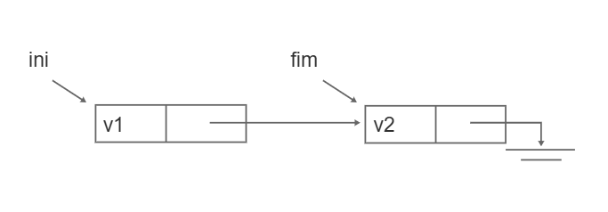

<details close>
    <summary><code>IMAGEM | Exemplo de um esquema de Fila Encadeada</code></summary>

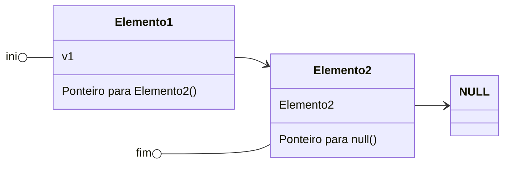
```mermaid	
---
title:
---
classDiagram
direction LR
    class Elemento1 {
        v1
        Ponteiro para Elemento2()
    }
    class Elemento2 {
        Elemento2
        Ponteiro para null()
    }

    Elemento1 --> Elemento2
    Elemento2 --> NULL

    ini ()-- Elemento1
    fim ()-- Elemento2
```

</details>

Note que para manter as extremidades de início e final da fila, é preciso agora ter 2 ponteiros auxiliares: **ini** (início da fila) e **fim** (final da fila). Assim é possível inferir que o nó com dado v1 foi o primeiro elemento que entrou na fila, uma vez que o ponteiro ini aponta para ele. Além disso, podemos ver que pelo ponteiro prox do nó com dado v1 que o nó com dado v2 foi o segundo inserido. Como a fila tem apenas 2 elementos, o nó com dado v2 é também o último elemento a entrar na fila, por isso o ponteiro final está apontado para esse nó.

É possível concluir que uma fila precisa dos seguintes componentes:

- O armazenamento de elementos
- Ponteiro para início da fila (ini)
- Ponteiro para final da fila (fim)

Defininfo com TAD esses componentes, temos:

```pt-br
Registro NO
    Inicio
        dado: do tipo_dos_elementos
        prox: ponteiro para registro NO
    Fim
ini,fim: ponteiro para registro NO
```

Especificações de tipo de dado FILA:

- Os valores que poderão ser armazenados na fila depende do tipo de dado que a aplicação precisa armazenar.
- As operações necessárias para manipulação da fila são:
    - **ENQUEUE** (fila, v): inserir um elemento em apenas uma extremidade da fila, conhecida como final da fila
    - **DEQUEUE** (fila, v): remove um elemento da fila em apenas uma extremidade da fila, conhecida como início da fila
    - **FIRST** (fila, v): lê o elemento que está no início da fila e armazena em v
    - **INIT** (fila): inicia a fila, deixando-a vazia
    - **ISEMPTY** (fila): verifica se a fila está vazia, retornando verdade se a fila estiver vazia e falso, caso contrário

<p align="right">(<a href="#readme-top">back to top</a>)</p>

## Implementando o Tipo de Dado Fila

<details close>
    <summary><code>Operações | INIT</code></summary>

#### INIT

Lembrando que a fila deve estar vazia no momento de sua criação. A função INIT deve deixar a indicação que os ponteiros de início e fim da fila não apontam para um nó. Para tanto, em linguagem algorítmica, os dois ponteiros devem receber (apontar) para NULO

Assim, iniciar uma fila deixando-a na condição de fila vazia implica em fazer ini = fim = NULO.

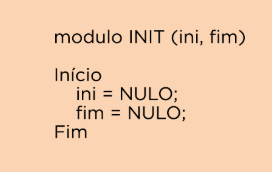

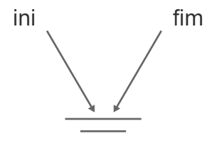

</details>

<details close>
    <summary><code>Operações | ISEMPTY</code></summary>

#### ISEMPTY

Verifica se a fila está vazia. Retornando verdade se estiver vazia, caso contrário, retorna falso.

Observe que a fila é considerada vazia se estiver no estado em que é iniciada pela função INIT

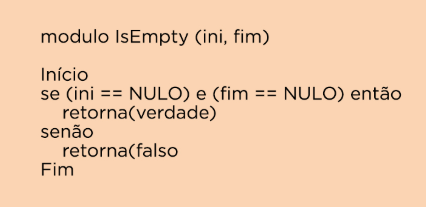

</details>

<details close>
    <summary><code>Operações | ENQUEUE (Insere na fila)</code></summary>

#### ENQUEUE

Esta operação deve iniciar alocando um novo nó para ser inserido na fila, depois armazena um valor no campo dado do novo nó e, finalmente, "encaixar" o novo nó na posição correta e alterar ponteiros necessários. Para o "encaixe", deve-se primeiro entender que quando inserido um elemento na fila, esse sempre se torna o último, sendo assim, não tem elemento que o sucede e, portanto, o ponteiro prox desse nó deve apontar NULO.

Existe duas situações distintas que devem ser analisadas para a inserção de um novo elemento:

- Se a fila estiver vazia, ambos os ponteiros de início e final da fila devem apontar para o mesmo nó.
- Caso contrário, apenas deve-se movimentar o ponteiro que aponta para o nó que está no final da fila.

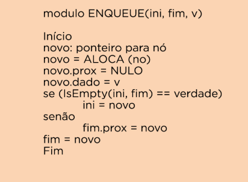

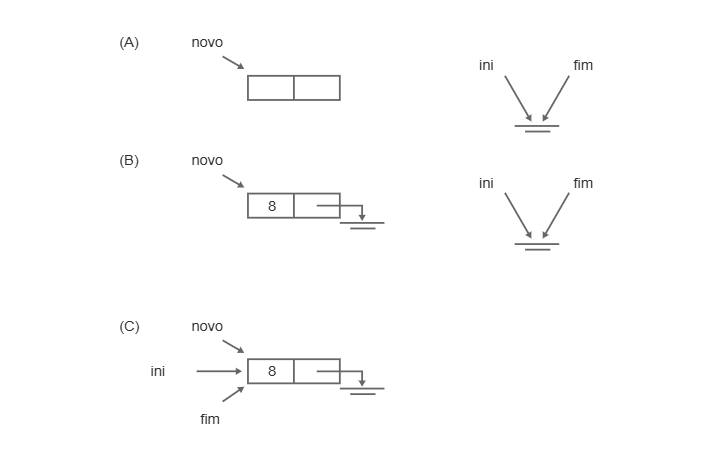

A descrição do passo a passo da inserção do novo nó:

1. A indicação de que a fila está vazia ocorre pelo estado em que se encontram os ponteiros ini e fim. Depois de alocar o nó este é apontado por novo.
2. O campo dado recebe 8 e o campo prox do novo nó alocado recebe o ponteiro NULO (uma vez quye sempre o nó inserido será o último da fila, ou seja, sem sucessor).
3. Posiciona o ponteiro ini (uma vez que a fila está vazia) e o ponteiro fim para apontar o novo nó alocado.

Para entender bem todas as etapas realizadas na inserção de um novo nó, vamos supor que a operação ENQUEUE(ini, fim, 5) seja executada em seguida.

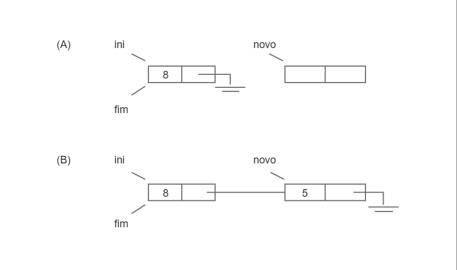

a. Iniciando com a alocação de um novo nó e a fila com estado deixado pelo ENQUEUE anterior
b. No novo nó campo dado recebe 5 e prox recebe NULO. Verificando que a fila não está mais vazia, o nó que estava no final da fila passa ter seu campo prox apontando para o mesmo local que o ponteiro novo aponta (ou seja, para o novo nó alocado), e depois fim passa apontar para o novo nó.

</details>

<details close>
    <summary><code>Operações | DEQUEUE (Retira elemento da fila)</code></summary>

#### DEQUEUE

Esta operação retira um elemento do início da fila se esta não estiver vazia. Para tanto, outras condições devem ser verificadas.

- Verificar se a fila está vazia e se não estiver:

Se a fila for composta por apenas 1 elemento: os ponteiros ini e fim devem ser alterados para NULO quando o elemento for retirado.

Caso tenha mais do que 1 elemento: o ponteiro ini é o único a ser alterado e deve apontar para o nó que se torna o primeiro da fila, ou seja, o nó sucessor do que está sendo retirado.

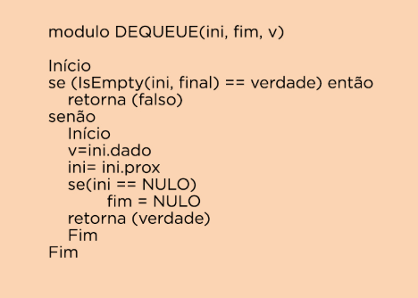

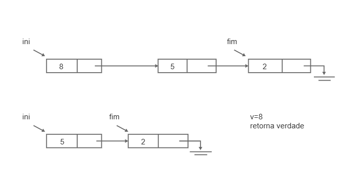

</details>

<details close>
    <summary><code>Operações | FIRST</code></summary>

#### FIRST

Essa operação lê o valor do dado do elemento que está no início da fila e retorna pelo parâmetro v. Essa função é equivalente da função TOP de uma pilha, ou seja, apenas retorna o valor do dado do elemento que está no início da fila sem alterar a fila.

</details>

<p align="right">(<a href="#readme-top">back to top</a>)</p>

## Implementação de Fila em Java

```java
public class Fila_INT {
  
    //definição nó da FILA	
	private static class NO{
	    public  int dado;
	    public  NO prox;
	}
  
    //definição dos ponteiros ini e fim	
	private static NO ini;
	private static NO fim;
	
	private static class Retorno{
	    public  int item;
	    public  boolean ok;
	}
	
	public void INIT() {
	    ini = null;
	    fim = null;
	}
	
	
	public boolean IsEmpty() {
	    return (ini == null && fim == null);
	}
	
	public void ENQUEUE(int item) {
        NO novo = new NO();
        novo.dado = item;
        novo.prox = null;
        if (IsEmpty()) {
            ini = novo;
        } else {
            fim.prox = novo;
        }
        fim = novo;
	}
  
  
	public Retorno DEQUEUE() {
        Retorno saida = new Retorno();
        if (!IsEmpty()) {
            saida.item = ini.dado;
            ini = ini.prox;
            if (ini == null) fim = null;
            saida.ok = true;
        } else {
            saida.ok = false;
        }
        return saida;
	}
	
	  
	public static void main(String[] args) {
  
        //Instanciando o objeto fila
	    Fila_INT fila = new Fila_INT();
  
        Retorno resultado = new Retorno();
	    Scanner entrada = new Scanner(System.in);
    	int item, opcao;
  
	    fila.INIT();
  
	    //repetição para inserir elementos na FILA
	    do { 
	    System.out.print("Digite dado inteiro: ");
	    item= entrada.nextInt();
	    fila.ENQUEUE(item);
	    System.out.print("Digite 0 para encerrar inserção de dados  ");
        opcao=entrada.nextInt();
	    } while (opcao != 0);
	
	
	    // repetira elemento da FILA até que esta fique vazia
	    do {
		    resultado = fila.DEQUEUE();
		    if (resultado.ok) {
		        System.out.println("Dado retirado: " + resultado.item);	
		    } 
        } while (resultado.ok);
  
    	entrada.close();	
	}
}
```

<p align="right">(<a href="#readme-top">back to top</a>)</p>

# Exemplo de Uso do Fila

A aplicação mais óbvia do tipo de dado fila é sua utilização em situações cotidianas.

No exemplo, cada paciente para entrar na fila deve fornecer o seu nome. A fila terá como campo dado o nome (String) de cada poaciente que entra no consultório e que será atendido.

```java
import java.util.*;
import java.io.BufferedReader;
import java.io.IOException;
import java.io.InputStreamReader;

public class Fila_Paciente {
        
    private static class NO{
        public  String dado;
        public  NO prox;
    }
        
    private static NO ini;
    private static NO fim;
    
    private static class RetornoP{
        public  String item;
        public  boolean ok;
    }
    
    public void INIT() {
        ini = null;
        fim = null;
    }
        
    public boolean IsEmpty() {
        return (ini == null && fim == null);
    }
        
    public void ENQUEUE(String item) {
        NO novo = new NO();
        novo.dado = item;
        novo.prox = null;
        if (IsEmpty())  
        ini = novo;
        else 
        fim.prox = novo;
        fim = novo;
    }

    public RetornoP DEQUEUE() {
        RetornoP saida = new RetornoP();
        if(!IsEmpty()) {
            saida.item = ini.dado;
            ini = ini.prox;
            if (ini == null) fim = null;
            saida.ok = true;
        }
        else
            saida.ok = false;
        return saida;
    }
        
        
    public static void main(String[] args) throws IOException {
        
        // Instacia a fila de pacientes
        Fila_Paciente fila = new Fila_Paciente();
        RetornoP resultado = new RetornoP();
        BufferedReader in = new BufferedReader(new InputStreamReader(System.in));
        Scanner entrada = new Scanner(System.in);
        
        int opcao;
        
        // Fila inicia vazia
        fila.INIT();

        // Menu para similar entrada e saída de pacientes em uma
        // fila em um consultório médico
        do { 
        System.out.println("1 - Insere paciente na fila de espera  ");
        System.out.println("2 - Chama cliente para atendimento  ");
        System.out.println("3 - Sair - apenas se não houver mais cliente na fila ");
        opcao=entrada.nextInt();
        switch (opcao) {
            case 1:	
            System.out.println("Digite nome do paciente ");
            String item= in.readLine();
            fila.ENQUEUE(item);
            break;
            case 2: 
            resultado = fila.DEQUEUE();
            if (resultado.ok)
                System.out.println("Cliente Chamado: "+ resultado.item);
            break;
            case 3: 
            if (!fila.IsEmpty()) {
                opcao = 4;
                System.out.println("Não pode encerrar, pois há clientes na fila ");
                }
            break;
            default:
            System.out.println("Opção inválida ");
            }
        } while (opcao !=3);
        entrada.close();	
    }
}
```

<p align="right">(<a href="#readme-top">back to top</a>)</p>
